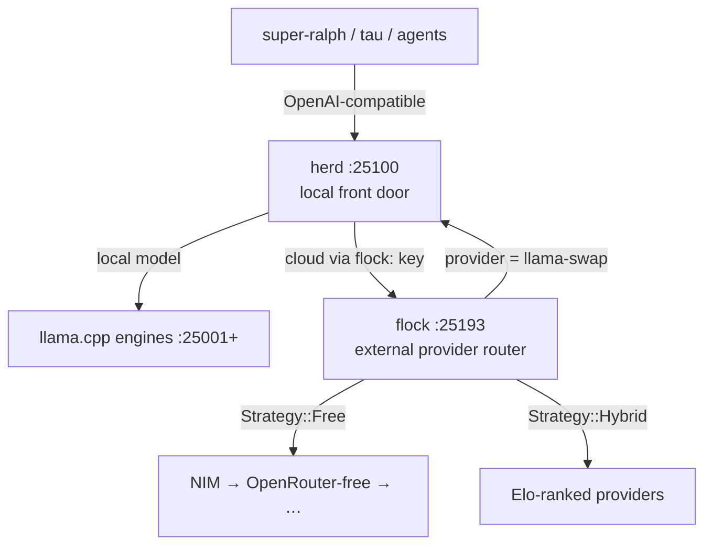

<div align="right">

[](https://github.com/toxicwind/ranch)
[](https://github.com/toxicwind/ranch)
[](https://github.com/toxicwind/flock)
[](https://github.com/toxicwind/ranch/stargazers)

</div>

# 🤠 ranch

**The ranch holds the herd, the flock, and every animal that works them.**

One map over the whole inference stack: the local front door, the external provider router, and the contract between them. No more re-deriving it from stray checkouts.

If you run models on a box and also call cloud APIs, this is the shape of the answer: local traffic stays local, cloud traffic goes through one rate-limit-aware router, and strategy names — not model names — decide the route. Everything here is OpenAI-compatible, so any client that speaks the API just works.

---

## 🐄🐦 The animals

| Service | Port | Source | Role |
|---|---|---|---|
| **herd** | `25100` | `stockyard/herd` (in-tree) — the llama-swap fork, Go | **LOCAL front door.** Serves on-box GGUFs over llama.cpp engines (`:25001+`). Anything cloud goes to the flock daemon via its `flock:` config key. |
| **flock** | `25193` | `remuda/flock/` (in-tree) — the Rust provider router; standalone repo [`toxicwind/flock`](https://github.com/toxicwind/flock) | **EXTERNAL provider router.** Rust. Strategies, key pools, 429 rotation, circuit breakers, health/Elo. NIM · OpenRouter · Groq · Cerebras · … |
| **gatehouse** | `25127` | `barn/gatehouse` (this repo) | **MCP gateway.** Tool serving. A peer of the others, not their parent — see [Not the holder](#not-the-holder). |
| **chute** | `25111` | `barn/chute` (this repo) | **Tau engine, TCP-exposed.** stdio→TCP ACP passage — the tau coding-agent engine as a daemon on a real port. |

All four run under **pitchfork** as daemons `herd`, `flock`, `gatehouse`, and `tau` (via chute).

## 📜 The contract

- herd serves what's local; anything cloud goes to the flock daemon via its `flock:` config key
- flock's `llama-swap` provider points back at herd `:25100` for local models
- **Strategy names are routing directives, not model names:** `free` → `Strategy::Free` → free-tier external providers (NIM first — the best damn free endpoint — then OpenRouter-free, …)
- The provider registry lives in flock. herd's in-tree `internal/flock` in-process router was retired 2026-09-17 and is not compiled into the shipped binary; the server imports routing from the upstream `llama-swap` module instead. Cloud routing is the `flock:` key
- See [docs/ARCHITECTURE.md](docs/ARCHITECTURE.md) for the full contract

---

## 🗺️ Request flow



---

## 🚀 Quick start

```sh
curl -s http://127.0.0.1:25100/v1/models | jq -r '.data[].id' | head
```

```sh
curl -s http://127.0.0.1:25193/v1/models -H "Authorization: Bearer $FLOCK_KEY" | jq -r '.data[].id' | head
```

```sh
for p in 25100 25193 25127; do printf '%s %s\n' "$p" "$(curl -s -o /dev/null -w '%{http_code}' http://127.0.0.1:$p/health)"; done
```

The free route, end to end:

```sh
curl -s http://127.0.0.1:25193/v1/chat/completions \
  -H "Authorization: Bearer $FLOCK_KEY" \
  -H "Content-Type: application/json" \
  -d '{"model":"free","messages":[{"role":"user","content":"moo"}]}'
```

---

## 🏗️ Architecture

### Local vs external

- **herd is LOCAL.** On-box models (GGUFs via llama.cpp engines), served at `:25100`. Lives in the monorepo (`stockyard/herd`); `~/sovereign/projects/herd` is a compat symlink to it. No separate fork repo.
- **flock is EXTERNAL.** Cloud providers — NVIDIA NIM, OpenRouter, Groq, Cerebras, … — routed at `:25193`. In-tree at `remuda/flock/` (moved 2026-09-30); standalone repo [`toxicwind/flock`](https://github.com/toxicwind/flock) kept.
- **gatehouse is a peer.** The MCP gateway (`barn/gatehouse`), not the parent of the other three.
- **chute is the tau engine's doorway.** `barn/chute` turns the tau coding-agent engine's stdio ACP into a TCP daemon at `:25111`, so agents are observable on a real port like everything else.

### Rules

1. **herd is local.** It lives in the monorepo. No separate fork repo.
2. **flock is external.** Own repo, own cadence; NIM/OpenRouter/Groq live there.
3. **Strategy names route; they are not models.** `free`, `hybrid`, etc. select flock strategies. Nothing advertises a literal model named `free`.
4. **NIM is a first-class free endpoint**, not something to bypass.
5. **No monkeypatches.** Fixes land in the owning repo.

### Not the holder

[gatehouse](barn/gatehouse) is the MCP gateway — tool serving, a peer of the ranch animals, not their parent. It was renamed mcpproxy → shep → gatehouse on 2026-09-26. (`shep` now means the unrelated [`shep-ai/shep`](https://github.com/shep-ai/shep) agent orchestrator, not this gateway.) Upstream is unchanged (`github.com/smart-mcp-proxy/mcpproxy-go`, binary `cmd/mcpproxy`), so `MCPPROXY_API_KEY` keeps its upstream name.

Its `mcp_config.json` is gitignored: gatehouse rewrites the effective config on every start, re-materializing live secrets. `mcp_config.json.dist` is the tracked scrubbed template, and `../bin/gatehouse-serve.sh` injects secrets from `/home/toxic/.secrets` at runtime, bootstrapping the live config from the template on a fresh checkout.

The ranch is held together by **pitchfork** (supervision), this repo (the map), and sovereign config (the wiring).

---

## 🌾 The wider ranch

| Path | What it is |
|---|---|
| `stockyard/` | In-tree code: `herd/` (llama-swap fork, Go) + `stream-broker/` — the routers moved out to `remuda/` |
| `remuda/` | All the routers: `flock/` (in-tree Rust router), `router-legacy/`, `paddock/` (VansRouter submodule) |
| `barn/gatehouse` | MCP gateway (`:25127`) — tool serving, peer of the animals |
| `barn/chute` | TCP ↔ stdio ACP passage: the tau engine as a daemon on `:25111` |
| `barn/browserless` | Browser automation (`:25130`): browserless.io MCP server + native-launcher deployment |
| `barn/gemini-mcp` | First-class Gemini API MCP server; multi-key pool with round-robin + failover |
| `barn/secretsmith` | Maximal freedesktop Secret Service CLI for the estate |
| `roundup/` | Roundup benchmark estate (renamed from guidellm 2026-09-30; in-tree code, standalone repo `toxicwind/roundup`) |
| `trailboss/` | Vendored defork of goldfinger: cuts repo selections across the org and drives changes through every head — built for agents as much as people |
| `drover/` | ModelPilot VS Code extension (multi-provider AI routing for Copilot Chat), sovereign build |
| `gear/` | The estate's skill library — hundreds of skills, one directory each |
| `ui/` | Ranch control UI — one Svelte SPA over herd + flock (llama-swap's web UI, adopted) |
| `squawk/` | File-based multi-agent chat: no daemon, no sockets — signed, sequenced message files |
| `squawk-ws/` | Squawk websocket client/server (`:25147`) |
| `corral/` | super-ralph agent framework (submodule) — the mission runner |
| `research/` | Provider/model discovery scripts |
| `data/` | Discovery + categorization JSON |

Each subproject keeps its own README; this file is the map, not the territory.

---

## ⚙️ Config

| Port | Service | Home |
|---|---|---|
| `25100` | herd (llama-swap fork, Go) | `stockyard/herd` |
| `25193` | flock router (Rust) | [`toxicwind/flock`](https://github.com/toxicwind/flock) → `/home/toxic/projects/flock` |
| `25127` | gatehouse (MCP gateway) | `barn/gatehouse` |
| `25111` | chute — tau ACP engine over TCP | `barn/chute` |
| `25104` | sovereign TS router (bench/Elo layer) | sovereign-projects |
| `25109` | keypool sidecar | sovereign-projects |
| `25001+` | llama.cpp engines | herd config |

**Secrets:** flock client auth via `$FLOCK_KEY` (minted in the flock repo); gatehouse secrets are injected at runtime from `/home/toxic/.secrets` — `mcp_config.json` is gitignored and re-materialized on every start. Never commit credentials.

---

## 🛠️ Dev

This repo is a **map** — the implementations live in their owning repos:

- herd changes → `stockyard/herd` (in-tree), following its own `CONTRIBUTING.md`
- flock changes → [`toxicwind/flock`](https://github.com/toxicwind/flock)
- gatehouse changes → `barn/gatehouse`
- chute changes → `barn/chute`
- Map changes (this README, `docs/ARCHITECTURE.md`, `remuda/*`) → here

When a subproject's README goes stale, fix it at the source and update the pointer row here. **No monkeypatches** — fixes land in the owning repo, never as local overlays.

---

## 📄 License & security

- **License:** this repo has **no LICENSE file** — no license is claimed here. Note: `stockyard/herd` carries its own `LICENSE.md`, and the flock proxy is MIT ([`toxicwind/flock`](https://github.com/toxicwind/flock) → `proxy/LICENSE`). Check the owning repo for the component you use.
- **Security:** secrets are never committed (`mcp_config.json` gitignored, flock keys in `/home/toxic/.secrets` or env). Gatehouse rewrites its effective config on every start from the scrubbed `mcp_config.json.dist` template. Report a vulnerability in a component to that component's owning repo.
