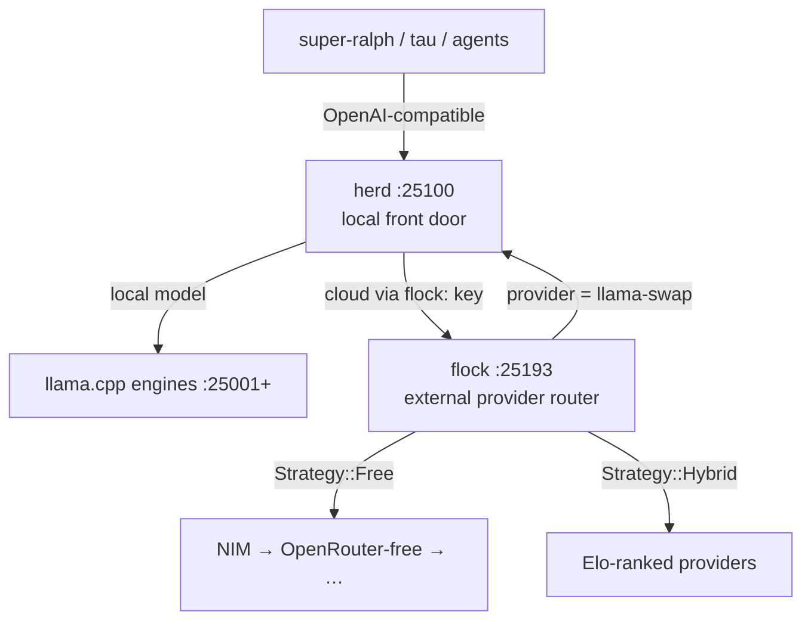

<div align="right">

[](https://github.com/toxicwind/ranch)
[](https://github.com/toxicwind/ranch)
[](https://github.com/toxicwind/ranch)
[](https://moonrepo.dev)
[](https://github.com/toxicwind/ranch/stargazers)

</div>

# 🤠 ranch

**Every animal on the spread, one map — one repo.**

The ranch is the whole inference and agent estate, laid flat: the local front door, the external provider router, the MCP gateway, the build-job system — and every tool that works them. One directory per animal, no pens inside pens. No more re-deriving it from stray checkouts.

If you run models on a box and also call cloud APIs, this is the shape of the answer: local traffic stays local, cloud traffic goes through one rate-limit-aware router, and strategy names — not model names — decide the route. Everything here is OpenAI-compatible, so any client that speaks the API just works.

This is a **real monorepo**: [Bun workspaces](https://bun.sh) link the TypeScript animals, [moon](https://moonrepo.dev) orchestrates polyglot tasks (Bun/TS, Go, Python, Rust) with pinned toolchains, and CI runs only what your change touches (`moon ci`).

---

## 🐄 The ranch

One table, every animal first-class — no "secondary" framing, no pens inside pens. 🟢 = live under pitchfork, port verified listening.

| Component | Port | Path | Role |
|---|---|---|---|
| 🟢 **herd** | `25100` | `herd/` (Go) | **LOCAL front door.** Serves on-box GGUFs over llama.cpp engines (`:25001+`). Anything cloud goes to the flock daemon via its `flock:` config key. |
| 🟢 **flock** | `25193` | `flock/` (Rust proxy + TS client/dashboard) | **EXTERNAL provider router.** Strategies, key pools, 429 rotation, circuit breakers, health/Elo. NIM · OpenRouter · Groq · Cerebras · … |
| 🟢 **gatehouse** | `25127` | `barn/gatehouse` | **MCP gateway.** Tool serving — a peer of the others, not their parent. |
| 🟢 **chute** | `25111` | `barn/chute` | **Tau engine, TCP-exposed.** stdio→TCP ACP passage — the tau coding-agent engine as a daemon on a real port. |
| 🟢 **squawk-ws** | `25147` | `squawk-ws/` (Python) | Squawk websocket server — the fleet channel's live socket. |
| 🟢 **fleet-ui** | `25136` | `squawk/fleet-ui.ts` (Bun) | Fleet web UI — tailnet + funnel, both lanes. |
| 🟢 **stream-broker** | `25215` | `stream-broker/` (Bun) | Event-streaming backbone for the estate. |
| 🟢 **windmill** | `25219` | `windmill/` (Bun) | GPU / PCIe telemetry — tells you which way the wind blows. |
| 🟢 **flicker** | `25148` | `flicker/` (Go) | **Fleet build-job system.** Disk-backed queue, streaming logs, content-hash artifact cache — a flicker marks the build. Cutting over from brand. |
| 🟢 **oracle** | `25151` | `oracle/` (Python) | 🔮 The decision corral — prediction-market work loop + deterministic Oracle verdict engine (dated yes/no, evidence-backed). Daemons: oracle-market, oracle-core, oracle-chat, bidder-forge/scout, market-watchdog. |
| 🟢 **browserless** | `25130` | `barn/browserless` | Browser automation: browserless.io MCP server + native-launcher deployment. |
| 🟢 **lookout** | `6080` | `barn/lookout` | **Isolated agent-browser display + viewer.** Xvnc :99 + interactive noVNC — the watchtower. |
| **roost** | — | `flock/roost/` (`@ranch/roost`, Bun/TS) | 🪹 The roost — the master provider catalog: every provider/model the estate perches on, one registry. Feeds tau, herd's generated Go, flock's generated Rust, the router. |
| **squawk** | — | `squawk/` (Python) | File-based multi-agent chat: signed, sequenced message files. NATS bus (`squawk/nats/`) underneath. |
| **corral** | — | `corral/` (in-tree, Bun/TS) | The super-ralph agent framework — the mission runner. Absorbed in-tree 2026-09-30 with full history; **no submodules, ever.** |
| **roundup** | — | `roundup/` | Benchmark estate — gathers and assesses every head. |
| **drover** | — | `drover/` | ModelPilot VS Code extension — multi-provider AI routing for Copilot Chat. |
| **lasso** | — | `lasso/` (Python) | Hyprland-native desktop control MCP — forked from hypruse. Window/screenshot/input control; three-strategy focus (hyprctl Lua / wlrctl / legacy). |
| **rig** | — | `rig/` (Rust workspace) | OpenFang kernel — 14 crates, the runtime the market rides on. |
| **campfire** | — | `campfire/` (Bun) | 🔥 The chatty helper system — multi-agent conversation layer. |
| **switchboard** | — | `switchboard/` (Bun) | Skill-router MCP server — `skill_search`/`skill_get` over the estate's SKILL.md index. |
| **barn/gemini-mcp** | — | `barn/gemini-mcp` (Python) | First-class Gemini API MCP server — multi-key pool, round-robin + failover. |
| **barn/secretsmith** | — | `barn/secretsmith` (Python) | Maximal freedesktop Secret Service CLI for the estate. |
| **spark** | — | `spark/` | Manifests + inventory. |
| **research** | — | `research/` | Provider/model discovery scripts. |
| **data** | — | `data/` | Discovery + categorization JSON. |
| **docs** | — | `docs/` | Architecture docs — the written contract. |
| ~~**brand**~~ | — | `brand/` | The branding iron — git hooks. **Deprecated:** brand consolidated into flicker. |
| ~~**branding**~~ | — | `branding/` (Python) | Old brand CLI/daemon. **Deprecated:** kept only as the `flicker-build` scripts' CLI fallback until the flicker cutover completes, then it goes. |

Each subproject keeps its own README; this file is the map, not the territory.

---

## 🏗️ The monorepo

**Bun workspaces** link every TypeScript animal (`bun install` at the root). **moon** runs tasks across languages:

```sh
bun install          # link all TS workspaces
moon run :build      # build every animal that defines a build task
moon run :test       # test every animal that defines one
moon run :lint       # lint every animal that defines one
moon ci              # affected-only: what CI runs on PRs
```

- Every animal with real build/test/lint steps has a `moon.yml` — the task is the contract, in the animal's native toolchain (`go test ./...`, `cargo test --workspace`, `python3 -m pytest`, `bun test`).
- Toolchains are pinned in [`.moon/toolchain.yml`](.moon/toolchain.yml) (bun 1.4.2, node 22, go 1.23, rust 1.89) — moon provisions them via proto, so agents and CI build identically. Python rides the estate interpreter (see the comment in `toolchain.yml`).
- **No submodules.** History is preserved with `git subtree`, never vendored as a snapshot.
- CI ([`.github/workflows/ci.yml`](.github/workflows/ci.yml)): PRs run `moon ci` (affected only); pushes to `main` run the full `:build :test :lint` sweep.

---

## 📜 The contract

- **Flat.** Every animal lives at the ranch root, one directory per component. No pens inside pens — if you need the map, this README is it.
- **herd serves what's local;** anything cloud goes to the flock daemon via its `flock:` config key
- **flock's `llama-swap` provider points back at herd `:25100`** for local models
- **Strategy names are routing directives, not model names:** `free` → `Strategy::Free` → free-tier external providers (NIM first — the best damn free endpoint — then OpenRouter-free, …)
- **The provider registry lives in roost** (`@ranch/roost`, nested under flock/). herd's in-tree `internal/flock` in-process router was retired 2026-09-17 and is not compiled into the shipped binary; the server imports routing from the upstream `llama-swap` module instead. Cloud routing is the `flock:` key
- **No monkeypatches.** Fixes land in the owning animal's files, never as overlays.
- **No submodules.** New code lands in-tree with history; vendoring without history is a bug.
- See [docs/ARCHITECTURE.md](docs/ARCHITECTURE.md) for the full contract

---

## 🗺️ Request flow



---

## 🚀 Quick start

```sh
curl -s http://127.0.0.1:25100/v1/models | jq -r '.data[].id' | head
```

```sh
curl -s http://127.0.0.1:25193/v1/models -H "Authorization: Bearer $FLOCK_KEY" | jq -r '.data[].id' | head
```

```sh
for p in 25100 25193 25127; do printf '%s %s\n' "$p" "$(curl -s -o /dev/null -w '%{http_code}' http://127.0.0.1:$p/health)"; done
```

The free route, end to end:

```sh
curl -s http://127.0.0.1:25193/v1/chat/completions \
  -H "Authorization: Bearer $FLOCK_KEY" \
  -H "Content-Type: application/json" \
  -d '{"model":"free","messages":[{"role":"user","content":"moo"}]}'
```

---

## 🏗️ Architecture

### Local vs external

- **herd is LOCAL.** On-box models (GGUFs via llama.cpp engines), served at `:25100`. Lives in the monorepo (`herd/`). No separate fork repo.
- **flock is EXTERNAL.** Cloud providers — NVIDIA NIM, OpenRouter, Groq, Cerebras, … — routed at `:25193`. In-tree at `flock/` (flattened 2026-09-30); standalone repo [`toxicwind/flock`](https://github.com/toxicwind/flock) kept.
- **gatehouse is a peer.** The MCP gateway (`barn/gatehouse`), not the parent of the other three.
- **chute is the tau engine's doorway.** `barn/chute` turns the tau coding-agent engine's stdio ACP into a TCP daemon at `:25111`, so agents are observable on a real port like everything else.

### Rules

1. **herd is local.** It lives in the monorepo. No separate fork repo.
2. **flock is external.** Own repo, own cadence; NIM/OpenRouter/Groq live there.
3. **Strategy names route; they are not models.** `free`, `hybrid`, etc. select flock strategies. Nothing advertises a literal model named `free`.
4. **NIM is a first-class free endpoint**, not something to bypass.
5. **No monkeypatches.** Fixes land in the owning animal.

### Not the holder

[gatehouse](barn/gatehouse) is the MCP gateway — tool serving, a peer of the ranch, not their parent. It was renamed mcpproxy → shep → gatehouse on 2026-09-26. (`shep` now means the unrelated [`shep-ai/shep`](https://github.com/shep-ai/shep) agent orchestrator, not this gateway.) Upstream is unchanged (`github.com/smart-mcp-proxy/mcpproxy-go`, binary `cmd/mcpproxy`), so `MCPPROXY_API_KEY` keeps its upstream name.

Its `mcp_config.json` is gitignored: gatehouse rewrites the effective config on every start, re-materializing live secrets. `mcp_config.json.dist` is the tracked scrubbed template, and `../bin/gatehouse-serve.sh` injects secrets from `/home/toxic/.secrets` at runtime, bootstrapping the live config from the template on a fresh checkout.

The ranch is held together by **pitchfork** (supervision), this repo (the map), and sovereign config (the wiring).

---

## ⚙️ Config

| Port | Service | Home |
|---|---|---|
| `25100` | herd (llama-swap fork, Go) | `herd/` |
| `25193` | flock router (Rust) | in-tree `flock/`; standalone repo [`toxicwind/flock`](https://github.com/toxicwind/flock) |
| `25127` | gatehouse (MCP gateway) | `barn/gatehouse` |
| `25111` | chute — tau ACP engine over TCP | `barn/chute` |
| `25148` | flicker (build-job system, Go) | `flicker/` |
| `25151` | oracle (decision engine, Python) | `oracle/` |
| `25147` | squawk-ws (fleet socket, Python) | `squawk-ws/` |
| `25136` | fleet-ui (Bun) | `squawk/fleet-ui.ts` |
| `25215` | stream-broker (Bun) | `stream-broker/` |
| `25219` | windmill (GPU telemetry, Bun) | `windmill/` |
| `25104` | sovereign TS router (bench/Elo layer) | sovereign-projects |
| `25109` | keypool sidecar | sovereign-projects |
| `25001+` | llama.cpp engines | herd config |

**Secrets:** flock client auth via `$FLOCK_KEY` (minted in the flock repo); gatehouse secrets are injected at runtime from `/home/toxic/.secrets` — `mcp_config.json` is gitignored and re-materialized on every start. Never commit credentials.

---

## 🛠️ Dev

The implementations live here, in-tree — one animal per directory:

- herd changes → `herd/` (Go), following its own `CONTRIBUTING.md`
- flock changes → `flock/` (`proxy/` Rust, `client/` + `dashboard/` TS)
- gatehouse changes → `barn/gatehouse`
- chute changes → `barn/chute`
- flicker changes → `flicker/` (Go)
- oracle changes → `oracle/` (Python)
- rig changes → `rig/` (Rust workspace)

Run the estate from the root:

```sh
bun install
moon run :test        # everything testable, in parallel
moon ci               # only what your branch touched
```

When a subproject's README goes stale, fix it at the source and update the pointer row here. **No monkeypatches** — fixes land in the owning animal, never as overlays.

---

## 📄 License & security

- **License:** this repo has **no LICENSE file** — no license is claimed here. Note: `herd/` carries its own `LICENSE.md`, and the flock proxy is MIT ([`toxicwind/flock`](https://github.com/toxicwind/flock) → `proxy/LICENSE`). Check the owning animal for the component you use.
- **Security:** secrets are never committed (`mcp_config.json` gitignored, flock keys in `/home/toxic/.secrets` or env). Gatehouse rewrites its effective config on every start from the scrubbed `mcp_config.json.dist` template. Report a vulnerability in a component to that component's owning repo.
