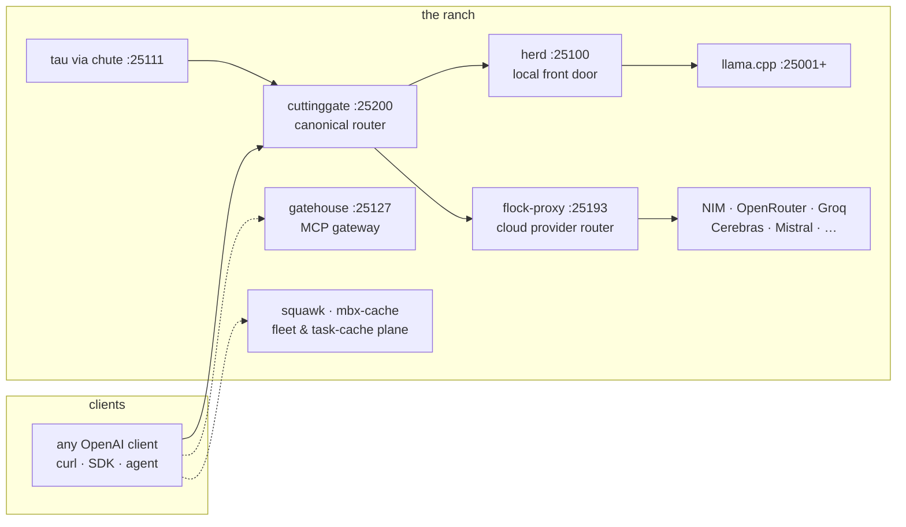

<div align="center">

[](https://github.com/toxicwind/ranch/actions/workflows/ci.yml)
[](LICENSE)
[](https://github.com/toxicwind/ranch/stargazers)
[](https://bun.sh)
[](https://mise.jdx.dev)
[](https://go.dev)
[](https://www.rust-lang.org)

# 🤠 ranch

**The AI estate's project monorepo.** Local model serving (**herd**), cloud provider routing (**flock**), the guard router (**cuttinggate**), the still-serving TS router (**sovereign-router**), the coding agent (**tau**), the MCP gateway (**gatehouse**), fleet chat (**squawk**), and the provider catalog (**roost**) live here — one directory per component, OpenAI-compatible at the edges.

> The decision engine (**oracle**) used to live here at `oracle/` — it moved out on 2026-10-02 (commit [`92bb79c`](https://github.com/toxicwind/ranch/commit/92bb79c)) to [toxicwind/squawk](https://github.com/toxicwind/squawk) (`oracle/`, verified live). Don't go looking for it in the ranch anymore.

[Explore the docs »](docs/) · [Report Bug](https://github.com/toxicwind/ranch/issues/new?labels=bug&template=bug_report.md) · [Request Feature](https://github.com/toxicwind/ranch/issues/new?labels=enhancement&template=feature_request.md)


</div>

<details>
<summary><b>Table of Contents</b></summary>
<ol>
<li><a href="#-about">About</a></li>
<li><a href="#%EF%B8%8F-built-with">Built with</a></li>
<li><a href="#-getting-started">Getting started</a></li>
<li><a href="#-30-second-proof">30-second proof</a></li>
<li><a href="#-usage">Usage</a></li>
<li><a href="#%EF%B8%8F-architecture">Architecture</a></li>
<li><a href="#-the-ranch--component-map">The ranch — component map</a></li>
<li><a href="#-repo-topology">Repo topology</a></li>
<li><a href="#-the-contract">The contract</a></li>
<li><a href="#%EF%B8%8F-roadmap">Roadmap</a></li>
<li><a href="#-contributing">Contributing</a></li>
<li><a href="#-license">License</a></li>
<li><a href="#-contact">Contact</a></li>
<li><a href="#-acknowledgments">Acknowledgments</a></li>
</ol>
</details>

---

## 🐄 About

If you run models on a box **and** call cloud APIs, this is the shape of the answer: local traffic stays local, cloud traffic goes through one rate-limit-aware router, and **strategy names — not model names — decide the route**. Any client that speaks the OpenAI API just works — `curl`, the OpenAI SDK, your agent framework of choice.

The ranch is a **real monorepo**, not a folder of checkouts: Bun workspaces link the TypeScript animals. Tool versions and build tasks resolve through mise; estate owns the shared build cache (`mbx-cache`), while each project owns its build command. One directory per animal, no pens inside pens — this README is the map.

### The agent this estate serves

**tau** is the coding agent — a terminal coding agent (fork of [oh-my-pi](https://github.com/can1357/oh-my-pi)) with an interactive CLI + SDK, 30+ tools, subagents, LSP-aware editing, and a native Rust hot path. It speaks to dozens of providers through a compiled model catalog sourced from **roost**, the ranch's single provider-data authority. Tau lives in its own repo ([toxicwind/tau](https://github.com/toxicwind/tau)) and nests into the ranch at `tau/` (gitignored — an independent repo with its own remote, absent in a fresh clone); on a live estate, **chute** exposes its stdio ACP engine as a TCP daemon on `:25111`, and its model traffic flows through herd and flock. If you only learn one animal, learn tau — the rest of the ranch exists so the agent can work.

## 🛠️ Built with

- [Go](https://go.dev) — herd (local front door), gatehouse (MCP gateway)
- [Rust](https://www.rust-lang.org) — flock proxy (provider router), rig (OpenFang kernel), tau's native hot path
- [Bun](https://bun.sh) + [TypeScript](https://www.typescriptlang.org) — workspaces, cuttinggate, fleet-ui, windmill, stream-broker, roost, tau's agent brain
- [Python](https://www.python.org) — squawk (fleet chat), squawk-ws, lasso (desktop control)
- [mise](https://mise.jdx.dev) — toolchains and build tasks; estate owns the Moon project graph
- **pitchfork** — the daemon supervisor: 81 configured services on the live estate

---

## 🚀 Getting started

### Prerequisites

| Tool | Version | Check |
|---|---|---|
| [Bun](https://bun.sh) | `1.4.2` (pinned in `estate/mise/conf.d/00-toolchain.toml`) | `bun --version` |
| [mise](https://mise.jdx.dev) | `2026.10.0` | `mise --version` |
| [Go](https://go.dev) | `1.23.1` | `go version` |
| [Rust](https://www.rust-lang.org) | stable | `rustc --version` |
| [Python](https://www.python.org) | `3.12` | `python3 --version` |

The live estate runs on a Linux box (Arch/CachyOS); the monorepo builds anywhere these toolchains exist.

### Installation

```sh
git clone https://github.com/toxicwind/ranch.git && cd ranch
bun install          # link the Bun workspaces
moon run :build       # build every animal with the pinned toolchains
```

Run the affected tests before you push — CI only runs what your change touches:

```sh
moon ci               # what CI will do
moon run :test         # everything, when you want it all
```

## ⚡ 30-second proof

On a live estate, the whole thing proves itself in four curls — no setup, no keys (verified 2026-10-02):

```sh
# 52 local models behind one OpenAI-compatible door
curl -s http://127.0.0.1:25100/v1/models | jq -r '.data[].id' | head -4
# beellama/exaone-4-0-1-2b-iq4xs
# beellama/exaone-4-0-1-2b-q4km
# beellama/exaone-4-0-1-2b-q5km
# beellama/exaone-4-0-1-2b-q6k

# every core service answers (the oracle decision engine moved out of the
# ranch on 2026-10-02 — it now lives in toxicwind/squawk, see repo topology)
for p in 25100 25127 25200; do
  printf '%s %s\n' "$p" "$(curl -s -o /dev/null -w '%{http_code}' http://127.0.0.1:$p/health)"
done
# 25100 200   herd — local front door
# 25127 200   gatehouse — MCP gateway
# 25200 200   cuttinggate — canonical router
```

Or run the checked-in version: [`examples/health-check.sh`](examples/health-check.sh).

## 💻 Usage

**1. Chat with a local model** — herd is OpenAI-compatible, so every OpenAI client works unchanged:

```sh
curl -s http://127.0.0.1:25100/v1/chat/completions \
  -H "Content-Type: application/json" \
  -d '{"model":"beellama/exaone-4-0-1-2b-q4km","messages":[{"role":"user","content":"moo"}]}'
```

**2. Route by strategy, not by model** — ask cuttinggate for "free" and it picks the best free-tier provider (NIM first, then OpenRouter-free, …) with 429 rotation and circuit breakers inside:

```sh
curl -s http://127.0.0.1:25200/v1/chat/completions \
  -H "Authorization: Bearer $CUTTINGGATE_KEY" \
  -H "Content-Type: application/json" \
  -d '{"model":"free","messages":[{"role":"user","content":"moo"}]}'
```

`free` is a **strategy name, not a model** — that's the whole routing contract. More in [examples/](examples/).

**3. Build the world** — one command builds every animal with the pinned toolchains; pitchfork supervises the live estate (82 daemons):

```sh
moon run :build     # build everything
moon run :lint      # lint everything
moon run :test      # test everything
```

---

## 🏗️ Architecture



Local stays local: herd serves on-box GGUFs and never sees cloud keys. Cloud goes through one rate-limit-aware router with key pools, 429 rotation, circuit breakers, and health/Elo ranking. Strategy names (`free`, `auto`, …) select routes — nothing advertises a literal model named `free`.

## 🤠 The ranch — component map

Every animal first-class — no "secondary" framing. 🟢 = port verified listening 2026-10-02 under pitchfork supervision.

| Component | Port | Path | Role |
|---|---|---|---|
| 🟢 **tau** | `25111` | `tau/` (nested checkout → [toxicwind/tau](https://github.com/toxicwind/tau), gitignored — absent in a fresh clone) | **The coding agent.** Terminal coding agent (fork of oh-my-pi): `omp` CLI + SDK, 30+ tools, subagents, native Rust hot path, dozens of providers via the roost-sourced catalog. Served as a TCP daemon through **chute**; its model traffic rides herd/flock. |
| **herd** | `25100` | `mesh/router/herd/` (Go) | **LOCAL front door — DOWN as of 2026-10-02.** The daemon died ~18:40 MDT (binary intact at `mesh/router/herd/herd`). Cloud traffic goes through cuttinggate on `:25200`. |
| **flock-proxy** | — | `mesh/proxy/flock-proxy/` (Rust) | **Preserved, not live.** External provider router: strategies, key pools, 429 rotation, circuit breakers, health/Elo. `:25193` retired 2026-10-02; cuttinggate fronts its role. |
| **keypool** | `25109` | `mesh/keypool/` (Bun/TS) | API key pool sidecar: health-probed key routing with failover + racing for the mesh routers. **DOWN as of 2026-10-02.** |

| 🟢 **cuttinggate** | `25200` | `mesh/proxy/cuttinggate/` (Bun/TS) | **Guard router.** Quarantine, circuit breaker, credential rotation, winner ledger. |
| 🟢 **sovereign-router** | `25104` | `mesh/router/sovereign-router/` | TS strategy router v3.2, still serving beside cuttinggate; not retired. |

| 🟢 **gatehouse** | `25127` | `barn/gatehouse` (Go) | **MCP gateway.** Tool serving — a peer of the others, not their parent. |
| 🟢 **chute** | `25111` | `barn/chute` | **Tau engine, TCP-exposed.** stdio→TCP ACP passage — the tau coding-agent engine as a daemon on a real port. |
| 🟢 **squawk-ws** | `25147` | `squawk-ws/` (Python) | Squawk websocket server — the fleet channel's live socket. |
| 🟢 **fleet-ui** | `25136` | `squawk/fleet-ui.ts` (Bun) | Fleet web UI — tailnet + funnel, both lanes. |
| 🟢 **stream-broker** | `25215` | `stream-broker/` (Bun) | Event-streaming backbone for the estate. |
| 🟢 **windmill** | `25219` | `windmill/` (Bun) | GPU / PCIe telemetry — tells you which way the wind blows. |
| **ledger** | — | `ledger/` (Bun) | 📒 The ranch account book — multi-provider token/cost accounting. Every provider key's tokens counted, dollars from verified per-token pricing, unpriced models surfaced — never guessed. |
| 🧰 **mbx-cache** | `25148` | `estate/ops/mbx-cache/` | Estate-owned mise remote task cache. Direct Rust binary; no queue or container runtime. |
| ~~**oracle**~~ | — | ~~`oracle/`~~ | 🔮 **Moved 2026-10-02** — the decision corral left the ranch (commit [`92bb79c`](https://github.com/toxicwind/ranch/commit/92bb79c)) and now lives in [toxicwind/squawk](https://github.com/toxicwind/squawk) at `oracle/`. |
| 🟢 **browserless** | `25130` | `barn/browserless` | Browser automation: browserless.io MCP server + native-launcher deployment. |
| 🟢 **lookout** | `6080` | `barn/lookout` | **Isolated agent-browser display + viewer.** Xvnc :99 + interactive noVNC — the watchtower. |
| **roost** | — | `mesh/catalog/` (`@ranch/roost`, Bun/TS) | 🪹 The master provider catalog: wire data, live discovery, aliases, cold-start seeds and quarantine. Feeds Tau, herd generated Go and flock-proxy generated Rust. |
| **squawk** | — | `squawk/` (Python) | File-based multi-agent chat: signed, sequenced message files. |
| **corral** | — | `corral/` (in-tree, Bun/TS) | The super-ralph agent framework — the mission runner. Absorbed in-tree 2026-09-30 with full history; **no submodules, ever.** |
| **roundup** | — | `roundup/` | Benchmark estate — gathers and assesses every head. |
| **drover** | — | `drover/` | Herd Router VS Code extension — herd-level model routing with Gemini EAP tool retrieval. |
| **lasso** | — | `lasso/` (Python) | Hyprland-native desktop control MCP — forked from hypruse. Window/screenshot/input control; three-strategy focus race. |
| **rig** | — | `rig/` (Rust workspace) | OpenFang kernel — 13 crates, the runtime the market rides on. |
| **campfire** | — | `campfire/` (Bun) | 🔥 The chatty helper system — multi-agent conversation layer. |
| **switchboard** | — | `switchboard/` (Bun) | Skill-router MCP server — `skill_search`/`skill_get` over the estate's SKILL.md index. |
| **barn/gemini-mcp** | — | `barn/gemini-mcp` (Python) | First-class Gemini API MCP server — multi-key pool, round-robin + failover. |
| **barn/secretsmith** | — | `barn/secretsmith` (Python) | Maximal freedesktop Secret Service CLI for the estate. |
| **spark** | — | `spark/` | ⚡ Dropbox operation — full inventory, mirror, organize + repo-ify; manifests + repo registry. |
| **research** | — | `research/` | Provider/model discovery scripts. |
| **data** | — | `data/` | Discovery + categorization JSON. |
| **docs** | — | `docs/` | Architecture docs — the written contract. |
| **mission-control** | — | `mission-control/` | 🎛 Event-driven continuation controller — a mission stays open until observable proof. |
| **task-launch** | — | `task-launch/` | 🚀 First-class classifier/task-launch repair (not a doc-wording patch). |
| **classifier** | — | `classifier/` | 🔧 Diagnostic CLI for classifier/safety-review failures — verifies actual execution from observable state. |
| **classifier-preflight** | — | `classifier-preflight/` | 🔧 Preflight task bodies, briefs, docs against known classifier trigger shapes. |
| **metaaivm** | — | `metaaivm/` | 📡 Incremental GitHub harvester for metaaivm keywords (daily cron on yote). |
| **metaaivm-profile** | — | `metaaivm-profile/` | 📡 First-class agent profile for the Meta AI VM estate. |
| ~~**brand / flicker**~~ | — | — | Retired. The estate replaced their arbitrary command queue with `mbx-cache` plus direct mise builds. |

---

## 🗂️ Repo topology

Where the ranch sits in the estate. All four `main` SHAs verified live on 2026-10-02 (`git ls-remote`).

| Repo | Visibility | `main` (verified) | Relationship |
|---|---|---|---|
| [toxicwind/ranch](https://github.com/toxicwind/ranch) | PUBLIC | `4323dda` | This repo — the workshop monorepo. |
| [toxicwind/estate](https://github.com/toxicwind/estate) | PUBLIC | `a52d28be3a` | The parent checkout: the ranch nests inside it at `ranch/` (gitignored in estate, own repo, own history). |
| [toxicwind/hatch](https://github.com/toxicwind/hatch) | PRIVATE | `b3b0630` | The control-cell split — the estate's `hatch/` tree as its own repo (167 commits, 573 files). |
| [toxicwind/squawk](https://github.com/toxicwind/squawk) | PUBLIC | `5f7eaf3` | New home of the oracle decision engine (`oracle/`) — migrated out of the ranch on 2026-10-02. |

The rule is simple: project work lives in the ranch, control-plane work in the estate, control-cell internals in hatch. The oracle left the ranch — don't go looking for it here.

## 📜 The contract

- **herd is local.** On-box models (GGUFs via llama.cpp engines), served at `:25100`. Cloud keys never touch it.
- **flock-proxy is preserved, not live.** The Rust external provider router (strategies, key pools, 429 rotation, circuit breakers, health/Elo) lives at `mesh/proxy/flock-proxy/`; `:25193` retired 2026-10-02 — cuttinggate now fronts cloud traffic.
- **cuttinggate is the front door.** `:25200` fronts cloud providers and gates herd-local traffic, with quarantine and a ledger. It replaced `:25104` (sovereign-router-ts, retired 2026-10-02) and absorbed the flock-proxy role.
- **Strategy names route; they are not models.** `free`, `auto`, etc. select routing strategies. Nothing advertises a literal model named `free`.
- **Everything is OpenAI-compatible.** `/v1/models`, `/v1/chat/completions` — any OpenAI client just works.
- **One directory per animal.** No pens inside pens, no submodules — corral was absorbed in-tree 2026-09-30 with full history.
- **roost is the single provider-data authority.** 75 provider definitions in `mesh/catalog/src/data.ts`; tau catalog, herd generated Go, and flock-proxy generated Rust all derive from it.
- **No monkeypatches.** Fixes land in the owning repo, never as local overlays. See [docs/ARCHITECTURE.md](docs/ARCHITECTURE.md) for the full contract.

## 🗺️ Roadmap

- [x] **herd rebrand** — `llama-swap` → `herd`, full project rename (2026-10-02)
- [x] **Moon monorepo** — every animal a first-class moon project, pinned toolchains (2026-09-30)
- [x] **corral in-tree** — super-ralph framework absorbed with full history, no submodules (2026-09-30)
- [x] **brand → flicker** — build-job system consolidated (2026-09-30)
- [x] **cuttinggate cutover** — `:25200` replaced `:25104`; sovereign-router-ts retired 2026-10-02
- [ ] **herd live cutover** — the `:25100` process moves to the renamed herd binary
- [ ] **flock probe fix** — provider probes stop appending `/v1/models` to bases that already carry it

Have a direction to propose? [Open an issue](https://github.com/toxicwind/ranch/issues/new?labels=enhancement&template=feature_request.md) — roadmap items start as issues.

## 🤝 Contributing

One directory per animal, no submodules, fixes in the owning repo — that's the whole culture. Read [CONTRIBUTING.md](CONTRIBUTING.md) for the on-ramp (moon tasks, commit conventions, the no-monkeypatch rule), then pick a [roadmap item](#%EF%B8%8F-roadmap) or an [open issue](https://github.com/toxicwind/ranch/issues). PRs that verify their claims against a live estate get merged fastest: show the `curl`, not the theory.

## 📄 License

Distributed under the **Apache License 2.0**. See [LICENSE](LICENSE) for more information.

## 📬 Contact

- **Issues:** [toxicwind/ranch issues](https://github.com/toxicwind/ranch/issues) — bugs and feature requests live here
- **Maintainer:** [@toxicwind](https://github.com/toxicwind)

## 🙏 Acknowledgments

- [oh-my-pi](https://github.com/can1357/oh-my-pi) — the coding agent tau is forked from
- [hypruse](https://github.com/hypruse/hypruse) — the Hyprland control lasso is forked from
- [smart-mcp-proxy](https://github.com/smart-mcp-proxy/mcpproxy-go) — the MCP proxy gatehouse builds on
- [moon](https://moonrepo.dev) and [Bun](https://bun.sh) — the polyglot task runner and runtime holding the monorepo together
- Every agent in the fleet who verified a port, fixed a table row, or proved a claim with a `curl`

---

> If the ranch saved you an afternoon, give it a ⭐ — and if it saved you a week, tell us in an issue. Thanks again! 🤠
