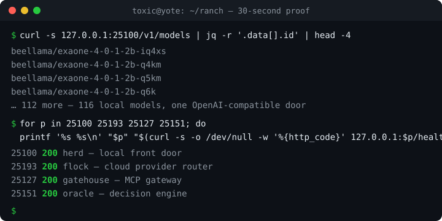
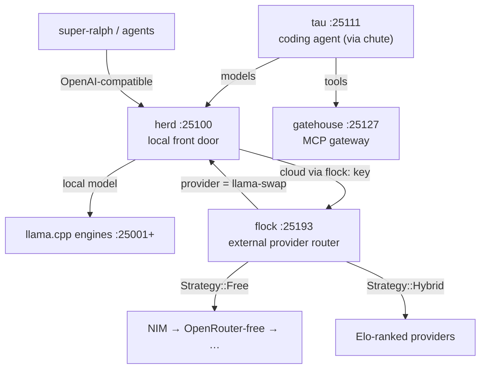

<div align="center">

[](https://github.com/toxicwind/ranch/actions/workflows/ci.yml)
[](LICENSE)
[](https://github.com/toxicwind/ranch/stargazers)
[](https://bun.sh)
[](https://moonrepo.dev)
[](#)
[](#)

# 🤠 ranch

**The whole self-hosted AI estate in one monorepo.** The coding agent (**tau**), local model serving (**herd**), cloud provider routing (**flock**), the MCP gateway (**gatehouse**), the build-job system (**flicker**), fleet chat (**squawk**), the decision engine (**oracle**), and the provider catalog (**roost**) they all share — one directory per component, the full mesh on one box.

[Explore the docs »](docs/) · [Report Bug](https://github.com/toxicwind/ranch/issues/new?labels=bug&template=bug_report.md) · [Request Feature](https://github.com/toxicwind/ranch/issues/new?labels=enhancement&template=feature_request.md)



</div>

<details>
<summary><b>Table of Contents</b></summary>
<ol>
<li><a href="#-about">About</a></li>
<li><a href="#-whats-new">What's new</a></li>
<li><a href="#-getting-started">Getting started</a></li>
<li><a href="#-30-second-proof">30-second proof</a></li>
<li><a href="#-the-ranch">The ranch — component map</a></li>
<li><a href="#️-request-flow">Request flow</a></li>
<li><a href="#-the-contract">The contract</a></li>
<li><a href="#-roadmap">Roadmap</a></li>
<li><a href="#-contributing">Contributing</a></li>
<li><a href="#-license">License</a></li>
<li><a href="#-contact">Contact</a></li>
<li><a href="#-acknowledgments">Acknowledgments</a></li>
</ol>
</details>

---

## 🐄 About

If you run models on a box **and** call cloud APIs, this is the shape of the answer: local traffic stays local, cloud traffic goes through one rate-limit-aware router, and **strategy names — not model names — decide the route**. Any client that speaks the OpenAI API just works.

The ranch is a **real monorepo**, not a folder of checkouts: [Bun workspaces](https://bun.sh) link the TypeScript animals, [moon](https://moonrepo.dev) orchestrates polyglot tasks (Bun/TS, Go, Python, Rust) with pinned toolchains, and CI runs only what your change touches (`moon ci`). One directory per animal, no pens inside pens — this README is the map.

### The agent this estate serves

**tau** is the coding agent — a terminal coding agent (fork of [oh-my-pi](https://github.com/can1357/oh-my-pi)) with an interactive CLI + SDK (`omp`), 30+ tools, subagents, LSP-aware editing, and a native Rust hot path. It speaks to 82 providers through a compiled model catalog sourced from **roost**, the ranch's single provider-data authority. Tau lives in its own repo ([toxicwind/tau](https://github.com/toxicwind/tau)) and nests into the ranch at `tau/` (gitignored — an independent repo, like `vansrouter/`); on a live estate, **chute** exposes its stdio ACP engine as a TCP daemon on `:25111`, and its model traffic flows through herd and flock. If you only learn one animal, learn tau — the rest of the ranch exists so the agent can work.

### Built with

- [Go](https://go.dev) — herd (local front door), flicker (build jobs), gatehouse (MCP gateway)
- [Rust](https://www.rust.org) — flock proxy (provider router), rig (OpenFang kernel), tau's native hot path
- [Bun](https://bun.sh) + [TypeScript](https://www.typescriptlang.org) — workspaces, fleet-ui, windmill, stream-broker, tau's agent brain
- [Python](https://www.python.org) — squawk (fleet chat), oracle (decision engine), lasso (desktop control)
- [llama.cpp](https://github.com/ggerganov/llama.cpp) engines behind herd for on-box GGUF serving

---

## ✨ What's new

- **2026-09-30 — flattened to a first-class monorepo.** `stockyard/` and `remuda/` are gone; every animal lives at the root. Bun workspaces + moon orchestration, toolchains pinned (bun 1.4.2 · node 22.12 · go 1.23.1 · rust 1.89.0).
- **tau live on `:25111`.** The coding agent ([toxicwind/tau](https://github.com/toxicwind/tau), fork of oh-my-pi) nests into the ranch at `tau/` and is served as a TCP daemon through **chute** — stdio ACP in, supervised port out, `mcpServers` shape normalized.
- **Squawk maximalization shipped** ([`4295bb4`](https://github.com/toxicwind/ranch/commit/4295bb4)): WS reconnect replay, atomic crash-safe feed writes, since-based feed replay; interactive noVNC viewer on the isolated agent-browser display.
- **flicker build daemon live on `:25148`** — disk-backed job queue, streaming logs, content-hash artifact cache. The branding iron (`brand`) is deprecated and consolidated into flicker.
- **roost — the master provider catalog** ([`5d75050`](https://github.com/toxicwind/ranch/commit/5d75050)): 53 providers in one registry feeding herd, flock, and tau.
- **lasso focus hyper-race**: three window-focus strategies (hyprctl Lua → wlrctl → legacy) raced, first strictly-verified win.
- **herd serving 116 local models** behind one OpenAI-compatible `/v1/models`.

See [CHANGELOG.md](CHANGELOG.md) for the running log.

---

## 🚀 Getting started

### Prerequisites

- `git`, `curl`, `jq`
- [Bun](https://bun.sh) ≥ 1.4.2 — moon provisions the rest via proto (go 1.23.1, rust 1.89.0, node 22.12.0), so every machine and CI build identically

### Installation

```sh
git clone https://github.com/toxicwind/ranch.git
cd ranch
bun install          # link all TypeScript workspaces
moon run :build      # build every animal that defines a build task
moon run :test       # test everything testable, in parallel
moon ci              # affected-only — exactly what CI runs on PRs
```

For the full estate, nest the coding agent in as an independent repo (gitignored, own remote):

```sh
git clone https://github.com/toxicwind/tau.git tau
```

---

## ⚡ 30-second proof

On a live estate, the whole thing proves itself in four curls — no setup, no keys:

```sh
# 116 local models behind one OpenAI-compatible door (verified 2026-09-30)
curl -s http://127.0.0.1:25100/v1/models | jq -r '.data[].id' | head -4
# beellama/exaone-4-0-1-2b-iq4xs
# beellama/exaone-4-0-1-2b-q4km
# beellama/exaone-4-0-1-2b-q5km
# beellama/exaone-4-0-1-2b-q6k

# every core service answers
for p in 25100 25193 25127 25151; do
  printf '%s %s\n' "$p" "$(curl -s -o /dev/null -w '%{http_code}' http://127.0.0.1:$p/health)"
done
# 25100 200
# 25193 200
# 25127 200
# 25151 200
```

The free route, end to end (needs a flock client key):

```sh
curl -s http://127.0.0.1:25193/v1/chat/completions \
  -H "Authorization: Bearer $FLOCK_KEY" \
  -H "Content-Type: application/json" \
  -d '{"model":"free","messages":[{"role":"user","content":"moo"}]}'
```

`free` is a **strategy name, not a model** — it routes to the best free-tier provider (NIM first, then OpenRouter-free, …) with 429 rotation and circuit breakers handled inside flock.

---

## 🐄 The ranch

Every animal first-class — no "secondary" framing. Statuses verified live 2026-09-30 (🟢 = port listening under pitchfork supervision).

| Component | Port | Path | Role |
|---|---|---|---|
| 🟢 **tau** | `25111` | `tau/` (nested checkout → [toxicwind/tau](https://github.com/toxicwind/tau), gitignored) | **The coding agent.** Terminal coding agent (fork of oh-my-pi): `omp` CLI + SDK, 30+ tools, subagents, native Rust hot path, 82 providers via the roost-sourced catalog. Served as a TCP daemon through **chute**; its model traffic rides herd/flock. |
| 🟢 **herd** | `25100` | `herd/` (Go) | **LOCAL front door.** 116 on-box GGUFs over llama.cpp engines (`:25001+`). Anything cloud goes to the flock daemon via its `flock:` config key. |
| 🟢 **flock** | `25193` | `flock/` (Rust proxy + TS client/dashboard) | **EXTERNAL provider router.** Strategies, key pools, 429 rotation, circuit breakers, health/Elo. NIM · OpenRouter · Groq · Cerebras · … |
| 🟢 **gatehouse** | `25127` | `barn/gatehouse` | **MCP gateway.** Tool serving — a peer of the others, not their parent. |
| 🟢 **chute** | `25111` | `barn/chute` | **Tau engine, TCP-exposed.** stdio→TCP ACP passage — the tau coding-agent engine as a daemon on a real port. |
| 🟢 **squawk-ws** | `25147` | `squawk-ws/` (Python) | Squawk websocket server — the fleet channel's live socket. |
| 🟢 **fleet-ui** | `25136` | `squawk/fleet-ui.ts` (Bun) | Fleet web UI — tailnet + funnel, both lanes. |
| 🟢 **stream-broker** | `25215` | `stream-broker/` (Bun) | Event-streaming backbone for the estate. |
| 🟢 **windmill** | `25219` | `windmill/` (Bun) | GPU / PCIe telemetry — tells you which way the wind blows. |
| **ledger** | — | `ledger/` (Bun) | 📒 The ranch account book — durable Gemini token/cost accounting from authoritative Google pricing. |
| 🟢 **flicker** | `25148` | `flicker/` (Go) | **Fleet build-job system.** Disk-backed queue, streaming logs, content-hash artifact cache. Brand consolidated into flicker. |
| 🟢 **oracle** | `25151` | `oracle/` (Python) | 🔮 The decision corral — prediction-market work loop + deterministic verdict engine (dated yes/no, evidence-backed). |
| 🟢 **browserless** | `25130` | `barn/browserless` | Browser automation: browserless.io MCP server + native-launcher deployment. |
| 🟢 **lookout** | `6080` | `barn/lookout` | **Isolated agent-browser display + viewer.** Xvnc :99 + interactive noVNC — the watchtower. |
| **roost** | — | `flock/roost/` (`@ranch/roost`, Bun/TS) | 🪹 The master provider catalog: 53 providers/models the estate perches on, one registry. Feeds tau, herd's generated Go, flock's generated Rust, the router. |
| **squawk** | — | `squawk/` (Python) | File-based multi-agent chat: signed, sequenced message files. NATS bus (`squawk/nats/`) underneath. |
| **corral** | — | `corral/` (in-tree, Bun/TS) | The super-ralph agent framework — the mission runner. Absorbed in-tree 2026-09-30 with full history; **no submodules, ever.** |
| **roundup** | — | `roundup/` | Benchmark estate — gathers and assesses every head. |
| **drover** | — | `drover/` | ModelPilot VS Code extension — multi-provider AI routing for Copilot Chat. |
| **lasso** | — | `lasso/` (Python) | Hyprland-native desktop control MCP — forked from hypruse. Window/screenshot/input control; three-strategy focus race. |
| **rig** | — | `rig/` (Rust workspace) | OpenFang kernel — 14 crates, the runtime the market rides on. |
| **campfire** | — | `campfire/` (Bun) | 🔥 The chatty helper system — multi-agent conversation layer. |
| **switchboard** | — | `switchboard/` (Bun) | Skill-router MCP server — `skill_search`/`skill_get` over the estate's SKILL.md index. |
| **barn/gemini-mcp** | — | `barn/gemini-mcp` (Python) | First-class Gemini API MCP server — multi-key pool, round-robin + failover. |
| **barn/secretsmith** | — | `barn/secretsmith` (Python) | Maximal freedesktop Secret Service CLI for the estate. |
| **spark** | — | `spark/` | Manifests + inventory. |
| **research** | — | `research/` | Provider/model discovery scripts. |
| **data** | — | `data/` | Discovery + categorization JSON. |
| **docs** | — | `docs/` | Architecture docs — the written contract. |
| ~~**brand**~~ | — | `brand/` | The branding iron — git hooks. **Deprecated 2026-09-30:** consolidated into flicker. |

Each subproject keeps its own README; this file is the map, not the territory.

---

## 🗺️ Request flow



---

## 📜 The contract

- **Flat.** Every animal lives at the ranch root, one directory per component — with two deliberate exceptions: `barn/`, the utility pen for small single-purpose tools (gatehouse, chute, lookout, …), and gitignored nested checkouts (`tau/`, `vansrouter/`, …) that are independent repos with their own remotes.
- **tau is the primary operator.** herd serves what's local; flock routes what's cloud; the rest of the estate (gateway, builds, chat, decisions, telemetry) exists so the agent can work.
- **herd serves what's local;** anything cloud goes to the flock daemon via its `flock:` config key
- **flock's `llama-swap` provider points back at herd `:25100`** for local models
- **Strategy names are routing directives, not model names:** `free` → `Strategy::Free` → free-tier external providers (NIM first — the best damn free endpoint — then OpenRouter-free, …)
- **The provider registry lives in roost** (`@ranch/roost`, nested under flock/)
- **No monkeypatches.** Fixes land in the owning animal's files, never as overlays.
- **No submodules.** New code lands in-tree with history; vendoring without history is a bug.
- See [docs/ARCHITECTURE.md](docs/ARCHITECTURE.md) for the full contract

---

## 🗺️ Roadmap

- [x] Flatten to a first-class monorepo — Bun workspaces + moon, pinned toolchains (2026-09-30)
- [x] Squawk maximalization — WS reconnect replay, crash-safe feed, since-based replay
- [x] flicker build daemon live; brand deprecated and consolidated
- [x] roost provider catalog (53 providers) feeding herd / flock / tau
- [x] lasso three-strategy focus hyper-race
- [ ] Squawk presence, threading, reactions, read receipts (deferred from maximalization)
- [ ] NATS as the first-class fleet bus under squawk (substrate research done)
- [ ] Persist router Elo across herd restarts
- [ ] Social preview + demo GIF refresh on every major release

Proposed features live as [issues](https://github.com/toxicwind/ranch/issues) — open one and it joins the queue.

---

## 🤝 Contributing

One paragraph: pick an animal, read its README, keep the contract (flat, no monkeypatches, no submodules), run `moon ci` before you push. The full on-ramp — commit style, PR checklist, how to add a new animal — is in [CONTRIBUTING.md](CONTRIBUTING.md).

---

## 📄 License

Distributed under the **Apache-2.0 License**. See [LICENSE](LICENSE) for more information.

Component licenses differ and win for their own code: `herd/` is MIT (upstream llama-swap fork, see `herd/LICENSE.md`), the flock proxy is MIT (see the standalone [`toxicwind/flock`](https://github.com/toxicwind/flock) repo).

---

## 📬 Contact

toxicwind — [@toxicwind](https://github.com/toxicwind). Bugs and feature requests go through [issues](https://github.com/toxicwind/ranch/issues); design discussion in [discussions](https://github.com/toxicwind/ranch/discussions).

---

## 🙏 Acknowledgments

- [llama-swap](https://github.com/mostlygeek/llama.cpp) lineage for herd's serving core
- [hypruse](https://github.com/hypruse) — lasso's upstream
- [oh-my-pi](https://github.com/can1357/oh-my-pi) — tau's upstream
- [smart-mcp-proxy/mcpproxy-go](https://github.com/smart-mcp-proxy/mcpproxy-go) — gatehouse's upstream
- [moonrepo](https://moonrepo.dev) and [Bun](https://bun.sh) for making the polyglot monorepo tractable
- Every pattern borrowed from the open-source repos that taught this estate its shape

---

⭐ Don't forget to give the project a star! Thanks again! 🤠
