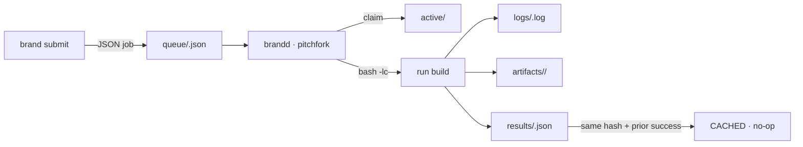

# brand — the fleet's continuous-modification engine

<div align="right">

[](https://github.com/toxicwind/sovereign-projects#license)
[](https://github.com/toxicwind/ranch)

</div>

Submit a build as a JSON job file; a pitchfork-managed daemon runs it
through your login shell (mise toolchains resolve exactly as they do
interactively), streams the log to a tail-able file, and **caches artifacts
keyed by content hash of the job spec**. Re-submit an identical job and it's
a no-op returning the cached result. Interrupted jobs restart cleanly on
daemon boot.

Source: `branding/` in `toxicwind/ranch` (also checked
out at `/home/toxic/sovereign/projects/range/ranch` on awrawr-pc).



## Features

- **Content-hash artifact cache** — job-spec hash = sha256 of
  `{repo, workdir, toolchain, cmd, env, artifacts}`. Any previously
  *succeeded* job with the same hash makes a resubmit return `CACHED`
  without running anything.
- **Forward-only semantics** — brand never touches your working tree:
  no `git checkout`, no stash, no revert. A failed build leaves the tree
  alone; you fix forward and resubmit (new spec hash → runs again).
- **Streaming logs** — `tail -f` while the build runs.
- **Boot resilience** — `active/` jobs return to `queue/` on daemon boot
  and re-run from scratch.
- **Toolchain preflight** — `bash -lc "command -v <bin>"` per job; missing
  mise toolchain fails the job in <1s with a clear message. The daemon
  orchestrates, **never installs**.

## Quick start

```bash
# Rust — build one crate of the tau engine workspace
brand submit --name tau-pi-ast \
  --repo /home/toxic/sovereign/tau/engine \
  --toolchain rust \
  --cmd "cargo build -p pi-ast"

brand status            # recent jobs table
brand logs <id> -f      # tail -f the streaming log
brand retry <id>        # re-queue a finished/failed job
brand health            # daemon health JSON
```

## Architecture

```
submit (CLI) ──JSON──▶ /home/toxic/brand/queue/<id>.json
                          │
brandd (pitchfork daemon, stdlib-only python3) polls queue/ every 2s
  1. claims job → moves to active/ (atomic; boot moves active/ back to queue/)
  2. preflights toolchain via `bash -lc "command -v <bin>"`
  3. runs `bash -lc "<cmd>"` in the job workdir, stdout+stderr → logs/<id>.log
  4. on success copies declared artifacts → artifacts/<jobhash>/ + manifest
  5. writes results/<id>.json and updates state.json (atomic tmp+rename)
health: http://127.0.0.1:25148/health  (pitchfork ready_http)
```

| path | purpose |
| --- | --- |
| `/home/toxic/brand/queue/` | pending job specs (`<id>.json`) |
| `/home/toxic/brand/active/` | claimed by the daemon (transient) |
| `/home/toxic/brand/logs/` | `<id>.log` — streamed during the build |
| `/home/toxic/brand/results/` | `<id>.json` — terminal result |
| `/home/toxic/brand/artifacts/` | `<jobhash>/` — cached outputs + `manifest.json` |
| `/home/toxic/brand/state.json` | job ledger (status/attempts/hashes/timings) |

Known toolchains: `rust`/`cargo`, `go`, `bun`, `node`, `python`/`python3`,
`tsc`. Flags: `--workdir` (defaults to `--repo`), `--env KEY=VAL`
(repeatable), `--artifact <relpath>` (repeatable), `--timeout` (default 1200s).

## Config

Pitchfork stanza `[daemons.brand]` in `/home/toxic/sovereign/pitchfork.toml`
(hand-edited — `scripts/generate.ts` must never run), also in `[groups.all]`.
Reload/start: `pitchfork start|restart|status|logs brand`.

| Env | Default |
| --- | --- |
| `BRAND_PORT` | `25148` |
| `BRAND_WORKERS` | `2` |
| `BRAND_POLL` | `2` (queue poll seconds) |

**Watchdog**: `brand-watchdog.py` (pitchfork daemon `brand-watchdog`):
polls `/health` every 20s, `pitchfork restart brand` after 3 consecutive
failures. Scoped to brand only — sibling lanes own their watchdogs.
(This covers the wedge case `retry=true` can't: process alive but health
dead — demonstrated 2026-09-14 with `kill -STOP`, watchdog restarted the
daemon in ~3s.)

**Compiler-cache proofs**: [`proofs/`](proofs) — reproducible
`sccache`/`ccache` verification scripts proving the daemon's pitchfork
environment wires compiler caches into every build job
(`RUSTC_WRAPPER=sccache`, `CCACHE_DIR`, cmake launcher vars).

## Failure modes

- Toolchain missing → `failed` in <1s, clear message, nothing ran.
- Build fails → `failed`, exit code + full log kept, tree untouched.
- Timeout → process group SIGKILLed, `failed`.
- Daemon dies mid-build → boot moves `active/` → `queue/`, re-runs cleanly.
- State file corrupt → warning logged, starts fresh (queue dir is the
  source of truth for pending work, `results/` for history).

## Dev / contributing

The daemon is stdlib-only `python3`; the CLI is symlinked into
`/home/toxic/bin`. Keep the forward-only contract: the daemon must never
mutate a working tree.

## License & security

MIT — see [LICENSE](https://github.com/toxicwind/sovereign-projects#license).

- Builds run arbitrary commands from job files **as your login user** —
  only trusted agents/users may submit.
- The daemon never installs toolchains: supply-chain risk stays in your
  mise config, not in brand.
