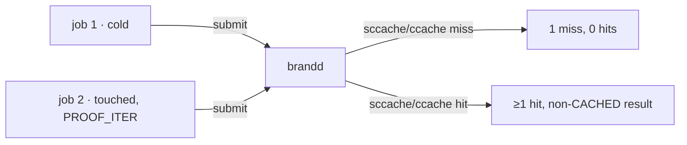

# brand compiler-cache proofs

<div align="right">

[](https://github.com/toxicwind/sovereign-projects#license)
[](https://github.com/toxicwind/sovereign-projects)

</div>

Reproducible proof scripts demonstrating that the brand daemon's
environment correctly wires compiler caches into every build job. Each
proof submits two identical jobs through the daemon: a cold run (expects a
cache **miss**) and a touched-source rerun with a distinct `PROOF_ITER` env —
so brand's own whole-job artifact cache can't short-circuit — expecting a
cache **hit**.



## Proofs

- **sccache (Rust)** — `brand-sccache-proof.sh`. Creates a lib+bin Rust
  crate (library target required — sccache treats binary-only crates as
  non-cacheable via the crate-type rule), zeroes sccache stats, submits job
  1 (cold: expects 1 miss, 0 hits), touches sources (identical content),
  submits job 2 with a distinct `PROOF_ITER` env (expects ≥1 hit).
  Verified 2026-09-21: `b260921-125457-494679c6` (1 miss),
  `b260921-125502-d8b067e7` (1 hit, 50% Rust hit rate). Both SUCCEEDED.
- **ccache (C)** — `brand-ccache-proof.sh`. Creates a C program, zeroes
  ccache stats, submits job 1: `ccache gcc -O2 -c main.c -o main.o`
  (compile step only — ccache does not cache link steps, so compile and
  link are split), then links with plain gcc and runs the binary (expects
  1 miss); job 2 with distinct `PROOF_ITER` (expects ≥1 hit).
  Verified 2026-09-21: `b260921-125554-02ec538e` (1 miss),
  `b260921-125559-291c3f98` (1 hit, 50% hit rate). Both SUCCEEDED.

## Quick start

```bash
./brand-sccache-proof.sh   # Rust path
./brand-ccache-proof.sh    # C path
```

Each script prints its two job IDs and asserts the miss→hit expectation.

## Architecture

Both caches are inherited from the brand daemon's pitchfork environment
(`pitchfork.toml` `[daemons.brand]`):

| Env | Effect |
| --- | --- |
| `RUSTC_WRAPPER=sccache` | all Rust compiles through sccache |
| `SCCACHE_DIR` | shared sccache cache dir |
| `CCACHE_DIR` | shared ccache cache dir |
| `CMAKE_C_COMPILER_LAUNCHER=ccache` / `CMAKE_CXX_COMPILER_LAUNCHER=ccache` | cmake C/C++ through ccache |

## Dev / contributing

Re-run both proofs after any change to the daemon's pitchfork env. If a
proof regresses to miss→miss, the env wiring broke — check the stanza
before suspecting the cache.

## License & security

MIT — see [LICENSE](https://github.com/toxicwind/sovereign-projects#license).

Proofs submit real build jobs through the daemon (arbitrary command
execution as your login user). Run them on the box that owns the daemon,
not from untrusted contexts.
