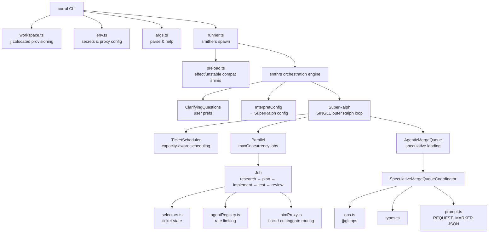

# 

> **Ticket-driven development & speculative merge queue — evolved from super-ralph lineage**

[](./package.json)
[](./LICENSE)
[](https://bun.sh)
[](https://www.typescriptlang.org/)
[](https://github.com/roninjin10/smithers)
[](https://effect.website)
[](./CONTRIBUTING.md)

**Corral** is a hardened fork of [super-ralph](https://github.com/roninjin10/super-ralph) built for sovereign agent fleets — parallel ticket execution, speculative landing, and zero-merge-conflict orchestration on top of [Smithers / smthrs](https://github.com/roninjin10/smithers).

If your original fork was a mess of hardcoded `/home/toxic` paths, 1189-line CLI files, duplicate deps, and ranch-specific shims — this is the clean replacement you can `rm -rf` and drop in.

---

## ✨ Why This Fork Exists

| Original `corral_hashline_read.txt` dump | This clean version |
|---|---|
| 53 files dumped with hashline markers | Proper folder structure |
| `bin/` hardcoded `/home/toxic/.secrets` | Portable, env-var driven `$HOME` |
| `src/cli/index.ts` **1189 lines** doing everything | Split into `env.ts` / `workspace.ts` / `args.ts` / `runner.ts` / `index.ts` (70 lines) |
| `smithers-orchestrator@0.32.0` + `smthrs@0.35.0` duplicate | Single `smthrs@0.35.0` |
| `src/*.test.ts` mixed in source | All tests in `tests/` |
| `mergeQueue/coordinator.ts` **851 lines** monolith | Split into `types.ts` / `ops.ts` / `prompt.ts` / `coordinator.ts` |
| Ranch-specific scripts (`guard-single-instance.sh`) | Removed — belongs in ranch repo |
| 6 bin aliases pointing to same file | Single `corral` bin |

---

## 🏗️ Architecture



### The Critical Fix (2026-09-21)

**Before:** Three sibling `<Ralph>` loops (scheduler, execution, merge queue) never converged. Scheduler ran to `maxIterations` before execution got a turn → `RALPH_MAX_REACHED` on every non-trivial task.

**After:** **Single outer Ralph loop** containing all three phases:

```tsx
<Ralph until={allWorkComplete} maxIterations={25} onMaxReached="fail">
  {activeCount < maxConcurrency && <TicketScheduler />}
  <Parallel maxConcurrency={maxConcurrency}>
    {activeJobs.map(job => <Job key={job.jobId} job={job} />)}
  </Parallel>
  <AgenticMergeQueue />
</Ralph>
```

Each iteration schedules, executes, and merges. Shared `allWorkComplete` predicate can actually become true.

---

## 🚀 Quick Start

```bash
# 1. Replace old mess with clean
rm -rf ~/estate/ranch/corral
tar -xzf corral-clean.tar.gz -C ~/estate/ranch/
mv ~/estate/ranch/corral-clean ~/estate/ranch/corral

# 2. Install
cd ~/estate/ranch/corral
bun install

# 3. Check env (portable, no /home/toxic hardcoded)
bun run src/cli/index.ts --check-env
# or
corral --check-env

# 4. Run
corral "Build a React todo app with local storage" --max-concurrency 8

# 5. With spec file
corral ./specs/feature.md --max-concurrency 8 --skip-questions

# 6. Dry run
corral "Add auth" --dry-run
```

### Install shim (optional, for full MCP tool support)

```bash
ln -sf $(pwd)/bin/claude-shim-wrapper.sh ~/.local/bin/claude
# Configure via env, not hardcoded:
export CORRAL_SECRETS_PATH=~/.config/corral/secrets
export GATEHOUSE_BIN=~/.local/bin/gatehouse
export CLAUDE_REAL_BIN=~/.local/bin/claude.nim-shim-real
```

---

## 📦 Installation

**Requirements:**
- [Bun](https://bun.sh) >=1.3.0
- [jj](https://github.com/martinvonz/jj) (Jujutsu VCS) — `cargo install jj-cli` or `mise`
- Git colocated repo (`jj git init --colocate`)

```bash
bun add @sovereign/corral
# or clone
git clone https://github.com/roninjin10/super-ralph.git corral
cd corral
bun install
```

### Workspace Provisioning

Corral auto-provisions isolated workspaces when you run outside a colocated repo:

```
~/.corral/runs/<stamp>-<slug>-<uniq>/
├── .jj/
├── .git/
├── .corral-workspace
└── main bookmark seeded
```

This prevents accidentally turning `$HOME` into a repo — original behavior that nuked home dirs.

---

## 🔧 CLI Reference

```
Usage:
  corral "prompt text"
  corral ./specs/feature.md --max-concurrency 8

Options:
  --cwd <path>              Repo root (default: current directory)
  --max-concurrency <n>     Workflow max concurrency override
  --max-iterations <n>      Ralph loop iteration ceiling (default: 25)
  --run-id <id>             Explicit Smithers run id
  --dry-run                 Generate workflow files but do not execute
  --skip-questions          Skip the clarifying questions phase
  --report --run-id <id>    Regenerate HTML run report, print path, exit
  --check-env               Dump redacted env + resolved router, exit
  --help                    Show help

Examples:
  corral "Build a React todo app"
  corral ./specs/feature.md --max-concurrency 8
  corral "Add authentication" --skip-questions
```

### Environment Variables

All secrets loading is now portable (no `/home/toxic/.secrets` hardcoded):

| Variable | Description | Default |
|---|---|---|
| `CORRAL_SECRETS_PATH` | Explicit secrets file | `~/.secrets` → `~/.config/corral/secrets` → `.env` |
| `ANTHROPIC_API_KEY` | Anthropic key | — |
| `SOVEREIGN_ROUTER_URL` / `CUTTINGGATE_URL` | Router URL | `http://127.0.0.1` |
| `SOVEREIGN_ROUTER_PORT` / `CUTTINGGATE_PORT` | Router port | `25200` |
| `FLOCK_API_KEY` | Flock proxy (comma-separated for rotation) | falls back to `NIM_PROXY_API_KEY` |
| `GATEHOUSE_BIN` | Gatehouse binary | `gatehouse` |
| `GATEHOUSE_CONFIG` | Gatehouse MCP config | `~/.config/corral/gatehouse/mcp_config.json` |
| `CLAUDE_REAL_BIN` | Real Claude binary | `~/.local/bin/claude.nim-shim-real` |

---

## 🧠 Components

### Core

- **`SuperRalph.tsx`** — Single outer Ralph loop (the fix), finite-by-default `maxIterations=25`, shared `allWorkComplete` predicate
- **`TicketScheduler.tsx`** — Capacity-aware scheduling, respects `maxConcurrency`, agent pool context table
- **`Job.tsx`** — Research → Plan → Implement → Test → Spec Review → Code Review → Review Fix → Land pipeline
- **`AgenticMergeQueue.tsx`** — Speculative landing with `maxSpeculativeDepth`, post-land checks, eviction handling

### Merge Queue (refactored)

| File | Responsibility | Lines |
|---|---|---|
| `types.ts` | All type definitions | 70 |
| `ops.ts` | `runJjCommand`, `runShellCommand`, `runCiInSpeculativeWorkspace`, `createDefaultOps` | 160 |
| `prompt.ts` | `REQUEST_MARKER`, `buildSpeculativeMergeQueuePrompt`, balanced brace JSON parser | 90 |
| `coordinator.ts` | `SpeculativeMergeQueueCoordinator` class, priority ranks, processing loop | ~400 |
| `index.ts` | Barrel re-export | 5 |

**Before:** 851-line monolith with `SpawnedProcess` hack. **After:** Testable, typed ops.

### CLI (refactored)

| File | Responsibility |
|---|---|
| `env.ts` | `loadSecrets()`, `redact()`, `CHECK_ENV_KEYS`, `parseFinite()`, `dumpCheckEnv()` |
| `workspace.ts` | `ensureWorkspace()`, `ensureJjAvailable()`, `initColocated()`, `seedInitialCommit()` |
| `args.ts` | `parseArgs()`, `printHelp()`, `BOOLEAN_FLAGS`, `getFlagString()` |
| `runner.ts` | `runWorkflow()`, preload gen, bunfig, smithers spawn, `writeReportQuietly()`, `printFinalReply()` |
| `index.ts` | 70-line thin entry |

### Other Key Files

- **`selectors.ts`** — Ticket state selectors (`selectAllTickets`, `selectProgressSummary`, etc.)
- **`agentRegistry.ts`** — Rate limiting (`rateLimitedUntil`, `isAvailable`, `recordRateLimit`)
- **`nimProxy.ts`** — Flock integration, key rotation, `proxyEnvOverrides()`, `NimProxyKeyPool`
- **`durability.ts`** — Cross-run ticket state, resumable tickets
- **`telemetricOracle.ts`** — Non-invasive EKG verdicts
- **`preload.ts`** — Effect `unstable/*` compat shims (only when native resolution fails)

---

## 🔌 Shim Architecture

```bash
corral
  └─▶ bin/claude-shim-wrapper.sh (portable)
       ├─▶ claude auth status → {"loggedIn":true} (Smithers preflight)
       ├─▶ --version/--help → real binary
       └─▶ prompt → python3 bin/claude-react-loop.py
                    ├─▶ fetch live Gatehouse catalog (36 servers / 258 tools)
                    ├─▶ inject tool instructions
                    ├─▶ call nim-shim-real (prompt→text)
                    ├─▶ parse <tool_call>{"server":...}</tool_call>
                    ├─▶ execute via gatehouse call <intent>
                    └─▶ loop until no tool tags (max 25 iter)
```

**Portable env vars:**

```bash
CORRAL_REACT_LOOP=./bin/claude-react-loop.py
GATEHOUSE_BIN=gatehouse
GATEHOUSE_CONFIG=~/.config/corral/gatehouse/mcp_config.json
CLAUDE_REAL_BIN=~/.local/bin/claude.nim-shim-real
NIM_BASE_URL=http://127.0.0.1:25200/v1
```

No more `/home/toxic/estate/ranch/range/bin/gatehouse` hardcoded.

---

## 📊 Comparison: super-ralph vs corral-clean

| Aspect | super-ralph@0.2.5 (orig) | corral-clean@1.0.0 |
|---|---|---|
| CLI | 1189 lines monolith | 70 lines + 4 modules |
| Merge queue | 851 lines monolith | 4 files, testable ops |
| Deps | `smithers-orchestrator` + `smthrs` duplicate | `smthrs` only |
| Paths | `/home/toxic/...` hardcoded | `$HOME`, env-var driven |
| Tests | Mixed in `src/` | All in `tests/` |
| Preload | Verbose ranch comments | Clean, documented |
| Bin | 6 aliases | Single `corral` |
| Scripts | Ranch-specific | Removed |
| Workspace | Could nuke `$HOME` | Safe isolated `~/.corral/runs` |
| Arch | 3 sibling Ralph loops (broken) | Single outer loop (fixed) |

---

## 🧪 Testing

```bash
bun test tests/
bun run typecheck
```

Tests moved from `src/` to `tests/`:
- `exactReply.test.ts`
- `finite-default.test.ts`
- `nimProxy.test.ts`
- `routing-regression.test.ts`
- `telemetric-oracle.test.ts`
- `timingRecovery.test.ts`

---

## 📝 License

MIT — see [LICENSE](./LICENSE)

Original super-ralph lineage: William Cory → Ronin Jin → Sovereign Fleet

---

## 🤝 Contributing

See [CONTRIBUTING.md](./CONTRIBUTING.md)

1. Fork
2. `bun install`
3. Make changes in `src/cli/` or `src/mergeQueue/` (not monoliths)
4. `bun test tests/` + `bun run typecheck`
5. PR

---

## 🗺️ Roadmap

- [x] Split 1189-line CLI
- [x] Split 851-line mergeQueue
- [x] Remove duplicate `smithers-orchestrator` dep
- [x] Portable shim (no `/home/toxic`)
- [x] All tests in `tests/`
- [x] Clean preload
- [ ] Upgrade Effect `beta.102` → `rc` / stable (breaking: `unstable/*` → stable paths)
- [ ] Add `bunfig.toml` to repo (currently generated)
- [ ] GitHub Actions CI (see `.github/workflows/ci.yml`)
- [ ] Add `docs/ARCHITECTURE.md` with sequence diagrams

---

<p align="center">
  <b>🐴 Sovereign Corral — Run 8 agents in parallel, land without conflicts</b><br/>
  <code>rm -rf corral && tar -xzf corral-clean.tar.gz && bun install && corral "ship it"</code>
</p>
