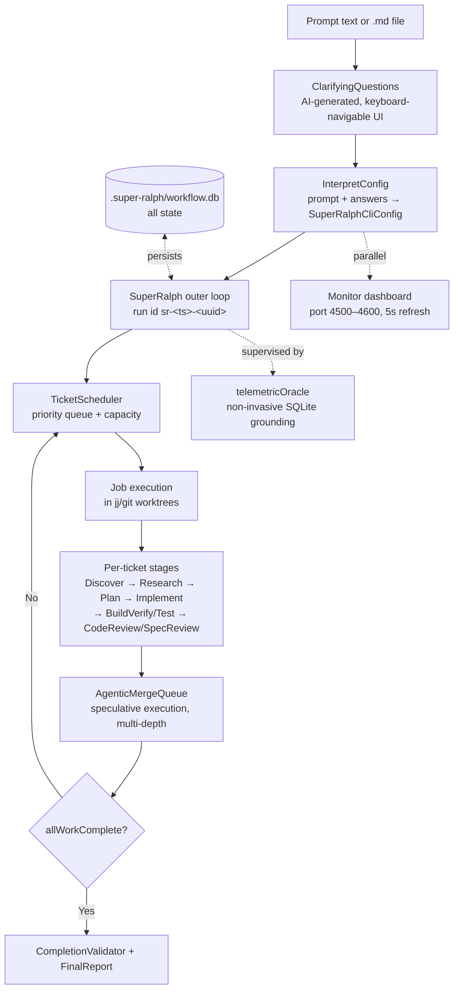

<div align="right">

[](https://bun.sh)
[](https://www.typescriptlang.org)
[](https://smithers.sh)
[](tests/)
[](LICENSE)

</div>

# Sovereign Corral

### Multi-agent ticket-driven engineering loops on Smithers — the `super-ralph` lineage, converged into one finite outer loop

**Corral** turns a prompt (inline text or a `.md` spec file) into a fully orchestrated engineering run: AI-generated clarifying questions, an AI-interpreted run configuration, parallel ticket execution by agent executors, a speculative merge queue, and a live monitor dashboard — with every step persisted to SQLite and resumable from any point.

**Who it's for:** engineers who want the [Ralph-loop](https://github.com/roninjin10/super-ralph) idea — autonomous agents working a spec until it's done — but with production-grade convergence guarantees, review gates, and full observability instead of a fire-and-forget loop. **Why it exists:** a single unified outer loop with `allWorkComplete` quiescence and a hard `--max-iterations` ceiling means a run *terminates*; the speculative merge queue means parallel agents don't step on each other; the SQLite-backed workflow tree means nothing is ever lost when a run dies.

---

## Features

- **Single unified outer Ralph loop with finite convergence** — schedule → execute → merge repeats until `allWorkComplete` quiescence, bounded by a hard iteration ceiling (`--max-iterations`, default `25`)
- **Interactive clarifying questions** — AI generates 10–15 contextual questions; a keyboard-navigable terminal UI collects answers (arrow keys, 1–5 shortcuts, custom answers); 12-question config questionnaire maps answers to concurrency, retries, and merge-queue depth; answers saved to `.super-ralph/generated/clarifications.json`; `--skip-questions` bypasses entirely
- **AI-interpreted run config** — `InterpretConfig` converts your prompt + clarification answers into a structured `SuperRalphCliConfig` (focuses, build/test commands, pre/post-land checks, code style, review checklist)
- **Per-ticket staged pipeline** — staged agent prompts for the full lifecycle: `Discover` → `Research` → `Plan` → `Implement` → `BuildVerify`/`Test` → `CodeReview`/`SpecReview` → `ReviewFix`, all in `src/prompts/*.mdx`
- **Speculative agentic merge queue** — `AgenticMergeQueue` + `mergeQueue/coordinator.ts` tests concurrent changes in temporary JJ/Git workspaces before landing; speculative depth configurable from conservative (1–2) to aggressive (5+); git repos are auto-adopted as colocated jj repos (`jj git init --colocate`)
- **Telemetric Cognitive EKG** — `telemetricOracle.ts` supervises runs via non-invasive SQLite state grounding: zero keystroke injection, no tmux send-keys, anchored to the 114-model Sovereign Router (`:25104`)
- **Proxy-based model routing** — every model call routes through the proxy by default; `FLOCK_API_KEY` preferred, deprecated `NIM_PROXY_API_KEY` still honored, provider keys as fallback; model alias resolves `FLOCK_MODEL` → `NIM_PROXY_MODEL` → default
- **Live monitor dashboard** — runs in parallel with the workflow; auto-discovers a port in 4500–4600, shows progress bars, quick stats, and an activity feed with 5-second auto-refresh
- **Full resumability** — all workflow state lives in `.super-ralph/workflow.db`; resume any run with `smithers-cli resume --run-id sr-…`; `scripts/reconcile-resume.sh` and `scripts/inspect-resume-state.sh` assist recovery
- **Dry-run mode** — generate the workflow files under `.super-ralph/generated/` without executing anything
- **Six CLI aliases, one binary** — `corral`, `ralph`, `taskforge`, `super-ralph`, `hyper`, `hyper-ralph` all map to `src/cli/index.ts`; consumed as local symlinks, never from a registry (private package, publishing disabled)
- **Pluggable agent executors** — `src/agentRegistry.ts` supports `claude-code`, `codex`, `gemini`, `kimi`, `amp`, and `custom` agents
- **Single-instance guard** — `scripts/guard-single-instance.sh` prevents overlapping loop instances

---

## How it flows



Generated artifacts land under `.super-ralph/` in the target repo: `generated/workflow.tsx` (the full Smithers workflow tree), `generated/clarifications.json`, and `workflow.db` (SQLite state, Smithers system tables + custom `clarifying_questions`, `interpret_config`, `discover`, `research`, `plan`, `implement`, `test_results`, `report`, `land` tables).

---

## Quick start

```bash
bun install
bun run src/cli/index.ts --help
corral ./PROMPT.md --dry-run
```

- `bun install` — install dependencies (CI uses plain `bun install`; `--frozen-lockfile` hangs on GH runners)
- `bun run src/cli/index.ts --help` — same as the `cli` package script; prints real usage and the six invocation aliases
- `corral ./PROMPT.md --dry-run` — generates `.super-ralph/generated/workflow.tsx` and friends without executing; the safe first run, requires no API key

A real run looks like:

```bash
corral "Build a React todo app"
ralph ./specs/feature.md --max-concurrency 8
hyper ./PROMPT.md --skip-questions --max-iterations 15
```

### CLI flags

| Flag | Description | Default |
|---|---|---|
| `--cwd <path>` | Repo root the workflow operates on | current directory |
| `--max-concurrency <n>` | Parallel active tickets override | from config/clarifications |
| `--max-iterations <n>` | Hard ceiling for Ralph loop convergence | `25` |
| `--run-id <id>` | Explicit Smithers run id | auto `sr-<ts>-<uuid8>` |
| `--dry-run` | Generate workflow files, don't execute | `false` |
| `--skip-questions` | Bypass the clarifying-questions phase | `false` |
| `--check-env` | Dump resolved model-routing env (keys redacted) and exit | — |
| `--help` | Show usage | — |

Requirements: **Bun ≥ 1.3.0**, **jj** (`jj` binary must be on `PATH` — the CLI errors otherwise; plain git dirs are adopted non-destructively via `jj git init --colocate`), and at least one agent executor reachable.

---

## Architecture

Everything is a [Smithers](https://smithers.sh) workflow tree (`smithers-orchestrator` 0.32.0): **all** AI interactions flow through workflow components — there are no direct agent calls outside the tree. The CLI generates the workflow, then executes it via `smithers-cli run`.

### Source layout

| Path | Role |
|---|---|
| `src/cli/index.ts` | CLI entry: arg parsing, env/agent/jj detection, workflow generation, execution |
| `src/cli/clarifications.ts` | The 12-question questionnaire; also exported as a module for AI agents (`getClarificationQuestions`, `buildAgentClarificationPrompt`) |
| `src/cli/interactive-questions.ts` | Blocking keyboard UI child process (external coordination, no Smithers core changes) |
| `src/components/SuperRalph.tsx` | The outer finite loop: scheduler → execution → merge queue → quiescence |
| `src/components/TicketScheduler.tsx` | Priority queue + capacity management |
| `src/components/Job.tsx` | Per-ticket execution unit |
| `src/components/AgenticMergeQueue.tsx` | Speculative merge queue component |
| `src/components/ClarifyingQuestions.tsx` | Question generation + collection component |
| `src/components/InterpretConfig.tsx` | Prompt + answers → `SuperRalphCliConfig` |
| `src/components/Monitor.tsx` | Live web dashboard component |
| `src/components/TicketResume.tsx` | Resume-path component |
| `src/components/CompletionValidator.tsx` | Terminal-state validation |
| `src/components/FinalReport.tsx` | End-of-run report component |
| `src/components/index.ts` | Component exports |
| `src/prompts/*.mdx` | 14 staged agent prompts: Discover, Research, Plan, Implement, BuildVerify, IntegrationTest, Test, CodeReview, SpecReview, CategoryReview, ReviewFix, Land, Report, UpdateProgress |
| `src/mergeQueue/coordinator.ts` | Speculative merge-queue coordination logic |
| `src/nimProxy.ts` | Proxy config resolution, env overrides, chat-completions routing |
| `src/telemetricOracle.ts` | Non-invasive telemetry supervisor over the SQLite workflow DB |
| `src/agentRegistry.ts` | Agent executor registry (`claude-code`, `codex`, `gemini`, `kimi`, `amp`, `custom`) |
| `src/hooks/useSuperRalph.ts` | React hook for the SuperRalph component |
| `src/schemas.ts` | Zod output schemas (`ralphOutputSchemas`) |
| `src/selectors.ts` | Output selectors (also exported as `@sovereign/corral/selectors`) |
| `src/durability.ts`, `src/scheduledTasks.ts` | Durability helpers, scheduled task definitions |
| `src/exactReply.ts` | Exact-reply detection/normalization utilities |
| `src/index.ts` | Library entry; exports `.`, `./selectors`, `./components`, `./cli/clarifications` |

### Library usage

```typescript
import { getClarificationQuestions, buildAgentClarificationPrompt } from "@sovereign/corral/cli/clarifications";
import { ClarifyingQuestions } from "@sovereign/corral/components";
```

### Provenance

Evolved from the `super-ralph` lineage (`package.json` `repository.url` points at `roninjin10/super-ralph`) into **Sovereign Corral** — the ticket enclosure & multi-agent engineering engine for the Sovereign estate. Key divergences from the upstream design: one unified outer loop instead of sibling loops, Sovereign Router (`:25104`) model anchoring instead of direct cloud API calls, the telemetric EKG supervisor, and the speculative JJ/Git merge queue.

---

## Configuration

Copy `.env.example` to `.env` (`.env` is gitignored — never commit it). The CLI loads `~/.secrets` for any unset keys.

| Variable | Purpose |
|---|---|
| `FLOCK_API_KEY` | Primary proxy API key — **required for real runs** |
| `NIM_PROXY_API_KEY` | Deprecated fallback, still honored |
| `ANTHROPIC_API_KEY` / `NVIDIA_API_KEY` | Provider-key fallbacks |
| `FLOCK_MODEL` / `NIM_PROXY_MODEL` | Model alias (`FLOCK_MODEL` → `NIM_PROXY_MODEL` → default) |
| `FLOCK_BASE_URL` / `NIM_PROXY_BASE_URL` / `NIM_BASE_URL` | Proxy base-URL overrides |
| `NIM_PROXY_BYPASS` | `1` bypasses the proxy (direct provider behavior — not recommended) |
| `SOVEREIGN_ROUTER_URL` / `SOVEREIGN_ROUTER_PORT` | Sovereign Router endpoint (port `25104` per `nimProxy.ts`) |
| `WORKFLOW_MAX_CONCURRENCY` | Concurrency override without flags |

Before starting an outer loop, run the pre-loop environment audit (`docs/ENV_AUDIT.md`): resolve the model alias, reject stale inherited `NIM_MODEL` names, confirm any bypass flags are intentional, and confirm keys are present without logging their values. `corral --check-env` dumps the resolved env with keys redacted.

**Optional services:** the Sovereign Router (`:25104`) is the default model anchor; the Monitor dashboard auto-binds a free port in 4500–4600. `mise.toml` pulls `ports.env` from the estate config and provides tasks (`install`, `test`, `typecheck`, `cli`, `help`).

### Docs

- [`docs/ARCHITECTURE.md`](docs/ARCHITECTURE.md) — Smithers workflow tree, components, DB schema, resume, troubleshooting
- [`docs/CLI_CLARIFICATIONS.md`](docs/CLI_CLARIFICATIONS.md) — the 12 questions and how answers map to run config
- [`docs/ENV_AUDIT.md`](docs/ENV_AUDIT.md) — pre-loop environment audit checklist
- [`docs/acceptance/accept14-20260921/ACCEPTANCE.md`](docs/acceptance/accept14-20260921/ACCEPTANCE.md) — acceptance record
- [`AGENT_HANDOFF.md`](AGENT_HANDOFF.md) — original refactor specification

---

## Development

```bash
bun install          # install
bun test tests/      # unit + integration suite
bun x tsc --noEmit   # typecheck — currently clean, 0 diagnostics
```

CI (`.github/workflows/corral.yml` at the repo root — GitHub only executes workflows from the root) gates every push/PR touching `corral/**`: plain `bun install` at the monorepo root (no `--frozen-lockfile`, no bun-store cache — both hung silently on GH runners), then `bun run typecheck` and `bun test tests/` scoped to `corral/`. `corral/.github/workflows/ci.yml` mirrors the same gates as the package-local contract. Typecheck and tests also run locally via the commands above or `mise run test` / `mise run typecheck`.

**Adding a new component** (from `docs/ARCHITECTURE.md`):

1. Create it in `src/components/`
2. Define its output schema with Zod
3. Export it from `src/components/index.ts`
4. Register the schema in `src/schemas.ts` → `ralphOutputSchemas`
5. Add a selector in `src/selectors.ts`
6. Export the selector from `src/index.ts`

**Note:** this is an *internal CLI, not a distributed library* — `package.json` sets `"private": true`, and `.github/workflows/publish.yml` is deliberately neutralized (publishing was disabled on purpose: the `@sovereign` npm scope belongs to an unrelated third party). The six bin aliases are consumed as `~/.local/bin` symlinks pointing at `src/cli/index.ts`, never via `npm install`.

---

## License & Security

**License:** MIT — Copyright (c) 2026 William Cory. See [`LICENSE`](LICENSE).

**Security notes:**
- API keys live in the environment (or `~/.secrets`) — never write them to disk beyond your gitignored `.env`, and never log key values; `corral --check-env` redacts them automatically
- `.env` is gitignored; the example values in `.env.example` are placeholders — replace before any real run
- No dedicated security contact is published in this repo; report issues via the repository's issue tracker
