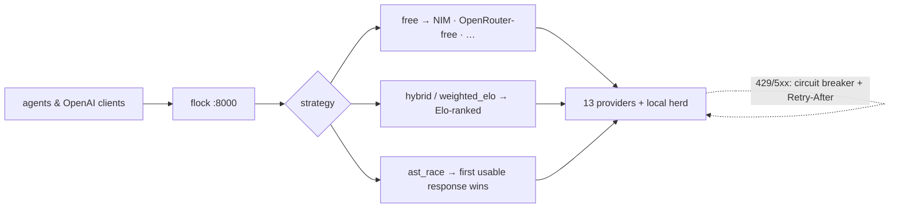

<div align="right">

[](https://github.com/toxicwind/flock)
[](https://github.com/toxicwind/flock)
[](proxy/LICENSE)
[](https://github.com/toxicwind/flock/stargazers)

</div>

# 🐦 flock

> 🗺️ Part of [**the ranch**](https://github.com/toxicwind/ranch) — the whole inference estate, one map.

**One OpenAI-compatible front door for every cloud model you can reach — with the rate-limit brains to stay inside every provider's speed limit.**

flock is the herd's sky counterpart: not local models, APIs. It routes `chat/completions` across **13 providers** — NVIDIA NIM, OpenRouter, Groq, Cerebras, Together, Fireworks, Hyperbolic, GitHub Models, Mistral, OpenAI, Perplexity, SiliconFlow, and back to local models via the herd provider — using named **strategies** instead of model names.

Built for agents that hammer the API at 3am: per-key sliding-window pacing, a global FIFO dispatcher, 429 ride-out with `Retry-After` honored, circuit breakers, and Elo health scoring that learns which provider is actually fast tonight.

One merged tree (2026-09-17), renamed in full from eight scattered NIM projects. Previously `nim-proxy` (+ clients, tools, dashboards, benchmarks); now one thing.

---

## ✨ Features

- **Strategy names route, they are not models** — `free`, `hybrid`, `ast_race`, `sticky_affinity`, `weighted_elo`, `least_latency`, `round_robin`, `circuit_chain` select routing behavior; model IDs pass through verbatim
- **`free` → the best damn free endpoint first** — NIM first, then OpenRouter-free, then the rest of the free tier, in order
- **Rate-limit-aware core** — exact sliding-window pacing per key (61 s windows, 25 ms grant spacing), a global FIFO dispatcher so no client starves another, sticky conversation→key affinity for warm prefix caches, least-loaded spillover when a lane fills
- **429/5xx ride-out** — honors upstream `Retry-After`, fails over between keys instantly, keeps streaming clients alive with SSE heartbeats instead of erroring
- **Circuit breakers + governor** — per-provider breakers, plus per-model worker-concurrency governing for NIM's worker ceilings (detected, backed off adaptively, surfaced on the dashboard)
- **Elo health scoring** — providers carry live Elo; `weighted_elo` and `least_latency` strategies route by measured reality
- **Observability built in** — embedded dashboard at `GET /` (Overview, Models, Clients, Reliability, Capacity), Prometheus `/metrics` (`flock_*` series), persistent history store
- **Fails closed** — first-run wizard, `npk_…` client keys shown exactly once, PBKDF2-HMAC-SHA256 passwords, config at mode 0600
- **Clients in two languages** — TypeScript + Python SDKs with `FlockKeyPool` (multi-key rotation, 429 parks the key, `Retry-After` parsing)
- **Load-tested to prove it** — 100 concurrent clients against a strict mock, zero upstream rate violations

---

## 🗺️ How it routes



---

## 🚀 Quick start

```sh
cd proxy && cargo run --release
```

Complete the first-run wizard at `http://127.0.0.1:8000` — it mints your `npk_…` client key. Then:

```sh
curl -s http://127.0.0.1:8000/v1/models -H "Authorization: Bearer $FLOCK_CLIENT_KEY" | jq -r '.data[].id' | head
```

Prefer Docker? `docker compose up -d` in `proxy/` works too (multi-arch image, loopback-published by default so a bare bring-up can't leak). In the ranch deployment this same binary runs supervised by pitchfork on `127.0.0.1:25193`.

---

## 🏗️ Architecture

### The request path

| Stage | What happens | Code |
|---|---|---|
| Routes | OpenAI-compatible `/v1/*`, dashboard `/api/*`, `/metrics`, `/health` | `proxy/src/routes.rs`, `api.rs` |
| Dispatch | Auth, deadline headers, global FIFO queue | `proxy/src/dispatch.rs` |
| Router | Strategy selection per model → candidate providers | `proxy/src/router.rs` |
| Providers | Canonical registry: 13 providers, weights, Elo, model lists | `proxy/src/providers.rs` |
| Key pool | Multi-key lanes per provider, round-robin, 429 parks the key | `proxy/src/pool.rs` |
| Rate limiter | Exact sliding-window pacing per key | `proxy/src/ratelimit.rs` |
| Circuit | Breakers per provider/lane, `Retry-After` backoff | `proxy/src/circuit.rs`, `proxy.rs` |
| Governor | Per-model worker-concurrency caps (NIM ceilings) | `proxy/src/governor.rs` |
| Health | Live Elo + latency tracking feeding `weighted_elo` / `least_latency` | `proxy/src/health.rs` |
| Observation | Prometheus series, history store, dashboard data | `proxy/src/observation.rs`, `history/` |

Strategy names intentionally match the herd's configured strategy identifiers, so existing herd/router configs keep meaning them. `flock:` is the herd config key that sends cloud traffic here; flock's own `herd` provider points back at herd `:25100` for local models.

### The tree

| Path | What it is | Origin |
|---|---|---|
| `proxy/` | **flock** — the Rust proxy: routing, pacing, dashboard, metrics. `cargo run --release`. | nim-proxy |
| `client/` | TypeScript + Python SDKs (`FlockClient`, `FlockKeyPool`, `probeModel`) | nim-client |
| `dashboard/` | Benchmark dashboard (Bun) — head-to-head model scorecards | nim-bench-dashboard |
| `tools/` | `nvt.py` CLI toolkit + `nvidia_nim_inference.py` free-endpoint inference script | nvidia-nim-tools, nvidia-free-endpoints |
| `research/` | Inkling API research (Go) | nim-inkling-api-research |
| `flock-final.sh` | Installer: install, run, wire flock into the stack (`--dry-run` supported, non-destructive) | nim-proxy-final.sh |
| `docs/` | `FLOCK-AUDIT-20260917.md` — the 7-section audit | — |
| `MIGRATION.md` | Phase 2 ABSORB guide (AstMatrix + nim-proxy → Rust core) | — |
| `FEATURE_PARITY.md` | Stray-implementation parity matrix — zero feature loss | — |

Upstream provenance: the proxy core derives from [miztertea/nim-proxy](https://github.com/miztertea/nim-proxy) (MIT).

---

## ⚙️ Config

Container-level env vars only — everything app-level lives in the dashboard Settings and persists to `DATA_DIR/config.json` (saves apply live):

| Variable | Default | Purpose |
|---|---|---|
| `HOST` / `PORT` | `0.0.0.0` / `8000` | Bind address and port |
| `DATA_DIR` | `data` (`/data` in Docker) | Config store + canonical `history-v1.jsonl`; must be writable |
| `TRUST_PROXY` | `false` | Trust `X-Forwarded-Proto`, mark session cookie `Secure` (behind TLS-terminating reverse proxy) |
| `RUST_LOG` | `nim_proxy=info` | Log filter |

Provider credentials are env vars read at boot (never committed — see the secret-hygiene block in the git history):

| Provider | Env var |
|---|---|
| NVIDIA NIM | `NVIDIA_API_KEY` |
| OpenRouter | `OPENROUTER_API_KEY` |
| Groq | `GROQ_API_KEY` |
| Cerebras | `CEREBRAS_API_KEY` |
| Together | `TOGETHER_API_KEY` |
| Fireworks | `FIREWORKS_API_KEY` |
| Hyperbolic | `HYPERBOLIC_API_KEY` |
| GitHub Models | `GITHUB_TOKEN` |
| Mistral | `MISTRAL_API_KEY` |
| OpenAI | `OPENAI_API_KEY` |
| Perplexity | `PERPLEXITY_API_KEY` |
| SiliconFlow | `SILICONFLOW_API_KEY` |

**Optional services:** the embedded dashboard (`GET /`, same-origin, no frontend build), Prometheus scraping at `/metrics` (any dashboard user, Basic or Bearer), and `flock-final.sh` for daemon install + client wiring. `/health` stays public for load-balancer probes and exposes nothing. **No built-in TLS** — terminate at a reverse proxy for any exposed deployment.

---

## 🛠️ Dev

```sh
cd proxy
cargo test          # unit + end-to-end vs a scripted mock NIM
```

- Load test: `python3 scripts/mock_nim.py --enforce --rpm 40 --port 9999`, run the proxy against it, then `python3 scripts/loadtest.py --clients 100 --requests 3` — exits non-zero on any client-visible failure or single upstream rate violation
- Fuzz targets in `proxy/fuzz/`; `cargo-deny` config in `proxy/deny.toml`
- MSRV 1.87, pinned in `proxy/rust-toolchain.toml`
- Workflow: read `proxy/CONTRIBUTING.md` first; design memory lives in `proxy/knowledge/` (start at `knowledge/index.md`)
- Full proxy docs: [`proxy/README.md`](proxy/README.md) — dashboard tabs, metric reference, security model, FAQ

---

## 📄 License & security

- **License:** the proxy is **MIT** — see [`proxy/LICENSE`](proxy/LICENSE). Upstream provenance is `miztertea/nim-proxy` (MIT). This repo root carries no separate license file; `client/` and `tools/` each carry their own `LICENSE`.
- **Security:** report vulnerabilities privately via [`proxy/SECURITY.md`](proxy/SECURITY.md), never in a public issue. The proxy fails closed: before setup `/v1` returns `503 setup_required`; after setup the dashboard always requires login and `/v1` is keyed (`npk_…`) or explicitly open — never accidentally open. Client key secrets are shown exactly once (only SHA-256 digest + last-4 stored); passwords are PBKDF2-HMAC-SHA256 (600k iterations); credentials live in `config.json` (mode 0600), not env vars.


## Build

The main build entry is `scripts/flicker-build.sh` — it submits the canonical
build+test as a job to flicker, the estate build-job system, and streams
the log. The job runs in `flock/proxy` (the in-tree Rust crate):

```bash
cargo build && cargo test
```

Run it via:

```bash
./scripts/flicker-build.sh
```

Honors `FLICKER_URL` (default `http://127.0.0.1:25148`). Exit 0 on success
(or cached identical success), 1 on failure/timeout.
