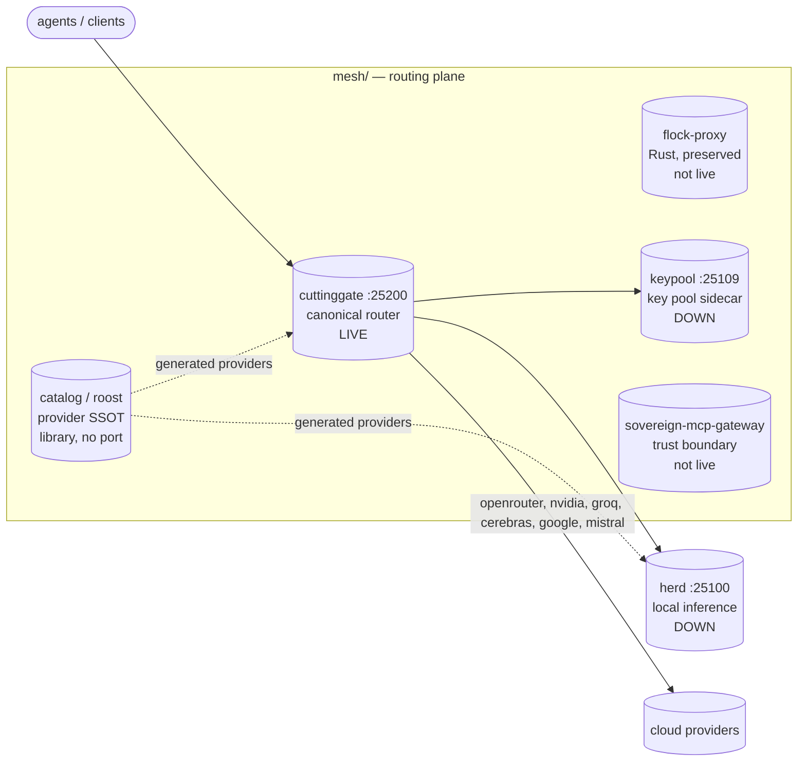

# Mesh — Tool Federation & Routing Layer

*One endpoint in front of everything: multi-provider LLM routing, MCP federation, and browser automation for the estate.*

 

**mesh/** is where the estate's traffic gets managed: every model an agent can think with is routed, health-checked, and load-balanced here. Local inference is owned by herd on :25100; mesh owns everything that decides *where a request goes next*. Tool and MCP federation lives with gatehouse at ranch/barn/gatehouse on :25127; mesh keeps the vendored mcpproxy engine source plus operator launchers under gateway/ and bin/.

## Why this exists

- **One gateway for tools** — gatehouse at ranch/barn/gatehouse fronts the estate's MCP servers with quarantine, BM25 tool discovery, and security scanning, so agents see one `retrieve_tools` call instead of hundreds of schemas.
- **One gateway for models** — cuttinggate on :25200 is the canonical live router: one OpenAI-compatible request fans out across providers with strategy-based failover, circuit breakers, and sticky sessions. The sovereign-router on :25104 is retired.
- **Zero-cost by default** — the `free` strategy races local GPU inference against every `:free` cloud model; cost-sensitive agents never touch a paid endpoint by accident.
- **A browser that remembers** — the browser-keeper is one persistent headed Chromium; logins, tabs, and state survive across tasks instead of being respawned per call.

## What's here

```text
mesh/
├── router/                     # model-routing plane
│   ├── herd/                   # Go inference backplane (:25100) — DOWN as of 2026-10-02
│   ├── sovereign-router/       # retired TS router (:25104 retired 2026-10-02, preserved)
│   ├── sovereign-mcp-gateway/  # MCP trust boundary (code default :25120, not live)
│   ├── flock-py/               # Python FastAPI router variant (reference)
│   ├── flock-router/           # TS/Bun AST router variant (4-way AST race)
│   └── free_zed_gateway/       # free-LLM gateway concept (folded into the `free` strategy)
├── proxy/                      # proxy plane
│   ├── cuttinggate/            # canonical LIVE router (:25200, Bun)
│   └── flock-proxy/            # Rust proxy (preserved, not live; :25193 retired)
├── catalog/                    # roost: provider catalog SSOT (TS library, no port)
├── keypool/                    # API key pool sidecar (:25109, DOWN as of 2026-10-02)
├── gateway/                    # vendored mcpproxy-go engine source + estate CloudRouter Go package
├── browserless/                # browserless.io MCP server (:25130) + keeper (:9223)
├── gemini-mcp/                 # first-class Gemini API MCP server (:25202, multi-key pool)
├── secretsmith/                # Secret Service CLI (secret-tool lineage, no port)
├── bin/                        # mesh operator scripts + launchers (see bin/README.md)
├── pitchfork.d/                # mesh-landing.toml and per-component daemon stanzas
├── config.landing.yml          # mesh landing config
```

## Routing map



## Quick Start

```bash
curl -sf http://127.0.0.1:25200/health      # cuttinggate (canonical router, LIVE)
curl -sf http://127.0.0.1:25200/v1/models   # cuttinggate model list
curl -sf http://127.0.0.1:25100/v1/models   # herd (local inference, DOWN as of 2026-10-02)
```

## cuttinggate — canonical router (:25200, LIVE)

**cuttinggate** is the live multi-provider gateway: one OpenAI-compatible endpoint fans requests across providers with strategy-based failover, circuit breakers, and sticky sessions. It replaced the sovereign-router on :25104 and absorbed the flock-proxy role.

Strategies:

| Strategy | Behavior |
| -------- | -------- |
| `hybrid` (default) | sticky → ast_race → circuit_chain |
| `free` | races local herd + every `:free` cloud model (zero-cost) |
| `ast_race` | parallel fan-out, first AST/code-shaped response wins |
| `sticky_affinity` | session-pinned routing for multi-turn |
| `weighted_elo` | ELO-weighted selection from success/latency history |
| `circuit_chain` | sequential with open/half-open circuit breakers |
| `fifo_matrix` | bounded FIFO queue (back-pressure) |

Override per request:
```bash
curl -H "X-Sovereign-Strategy: free" http://127.0.0.1:25200/v1/chat/completions
```

## sovereign-router (:25104, RETIRED 2026-10-02)

The TypeScript router is retired: :25104 has nothing listening, the pitchfork stanza is `pitchfork.d/sovereign-router.toml.retired-20261002`, and `config/ports.env` records the retirement. The code is preserved at `router/sovereign-router/` for reference. Use cuttinggate on :25200 instead.


## Sovereign MCP gateway (not live)

`router/sovereign-mcp-gateway/` is a trust boundary in front of upstream MCP servers: per-upstream circuit breakers quarantine poisoned servers, `notifications/initialized` pins sticky sessions, and `tools/list` is served as a provenance-namespaced union (`<upstream>__<tool>`) with 502 failover. The code defaults to :25120, but that port is canonically sovereign-chat's per `estate/pitchfork.toml` — do not start the gateway on :25120 without resolving the collision. No pitchfork stanza, nothing listening.

## Relationship to herd

Herd owns local inference (`:25100`, DOWN as of 2026-10-02 — the daemon died, binary intact at `router/herd/herd`). Mesh owns routing and points at herd as the local leg:

```yaml
openai-compatible:
  baseUrl: http://127.0.0.1:25100/v1
```

## Ops notes (2026-10-02)

- herd (:25100) died 2026-10-02 ~18:40 MDT; binary intact at `router/herd/herd`. Restart via the herd pitchfork stanza or `stack/services/herd.sh` on the estate side — do not start a second instance if pitchfork shows it errored but the port serves 200 (stale supervisor ownership).
- cuttinggate (:25200) is the only live mesh port as of 2026-10-02 ~19:00 MDT. :25104 (sovereign-router) retired, :25193 (flock) retired, :25109 (keypool) down, :25120 (sovereign-mcp-gateway) never live, :25127 (gatehouse) down.

## Gemini API Tool Retrieval EAP

The Gemini API Early Access Program for Tool Retrieval is directly relevant to gatehouse: `defer_loading: true` offloads tool schemas server-side and a retrieval meta-tool lets the model search a large tool catalog dynamically — designed for 30+ tool catalogs, exactly gatehouse's shape (30 upstream MCP servers). Docs: <https://ai.google.dev/gemini-api/docs/tool-retrieval>

- Platform fixes confirmed by Google (2026-09-07): HTTP 400 on deferred tools with parameters fixed fleet-wide; token-accounting fix for uncalled deferred tools rolling out.
- Integration target: NATIVE Gemini path — POST `/v1beta/interactions` on `gemini-flash-tool-retrieval` with the EAP key, server-side mode with gatehouse's 30-server union as `mcp_server` entries + `defer_loading: true`. NOT the OpenAI-compat `/v1beta/openai` path (no EAP semantics there), and NOT nim-proxy. Full spec in `docs/gemini-tool-retrieval.md`; LLM-friendly API reference in `docs/gemini-tool-retrieval-reference.md`. BLOCKED on depleted prepay credits.

## Member roster

Status verified 2026-10-02 ~19:00 MDT via ss + curl.

| Member | Path | Port | Status |
| ------ | ---- | ---- | ------ |
| cuttinggate | `proxy/cuttinggate/` | :25200 | **LIVE** — canonical router |
| herd | `router/herd/` | :25100 | DOWN — Go inference backplane, daemon died, binary intact |
| flock-proxy | `proxy/flock-proxy/` | :25193 | retired, preserved not live (Rust) |
| catalog (roost) | `catalog/` | — | TS provider SSOT library, no port |
| keypool | `keypool/` | :25109 | DOWN — key pool sidecar |
| sovereign-router | `router/sovereign-router/` | :25104 | retired 2026-10-02, preserved |
| sovereign-mcp-gateway | `router/sovereign-mcp-gateway/` | :25120 | not live; code default :25120 collides with sovereign-chat's canonical port |
| flock-py | `router/flock-py/` | — | Python FastAPI router variant (reference) |
| flock-router | `router/flock-router/` | — | TS/Bun AST router variant (4-way AST race) |
| free_zed_gateway | `router/free_zed_gateway/` | — | free-LLM gateway concept |
| gateway | `gateway/` | — | vendored mcpproxy-go engine + estate CloudRouter Go package |
| browserless | `browserless/` | :25130 / :9223 | DOWN — MCP server + keeper |
| secretsmith | `secretsmith/` | — | Secret Service CLI, no port |
| gemini-mcp | `gemini-mcp/` | :25202 | DOWN — Gemini API MCP server |
| mesh-landing | `bin/landing.py` | :25207 | DOWN — mesh landing service |
| bin/ | `bin/` | — | operator scripts + launchers (see bin/README.md) |
| pitchfork.d/ | `pitchfork.d/` | — | mesh-landing.toml, per-component daemon stanzas |

## Layers

New code goes where its layer lives. Do not invent new top-level dirs without a reason.

| Layer | Dir | What belongs here |
| ----- | --- | ----------------- |
| router/ | `router/` | anything that decides where an LLM request goes: herd, router variants, gateways |
| proxy/ | `proxy/` | terminating proxies in front of providers: cuttinggate, flock-proxy |
| catalog/ | `catalog/` | the provider catalog SSOT and its generated artifacts — nothing else |
| keypool/ | `keypool/` | key-pool sidecar only |
| gateway/ | `gateway/` | vendored MCP proxy engine source + the CloudRouter Go peer package |
| browserless/, gemini-mcp/, secretsmith/ | — | single-purpose integrations, one dir each |
| bin/ | `bin/` | operator launchers (pitchfork `run=` glue, probes, shims) |
| pitchfork.d/ | `pitchfork.d/` | daemon stanzas, one file per component |

## Data flow

agent/client → cuttinggate :25200 → cloud providers (openrouter, nvidia, groq, cerebras, google, mistral)
agent/client → cuttinggate :25200 → herd :25100 → local GPU (when herd is up)
cuttinggate → keypool :25109 → API keys for cloud providers
catalog → generated providers.{go,rs,json,yml} → cuttinggate, herd, flock-proxy (byte-identical copies, sync-tested)

## Purposeful symlinks

- `estate/herd` → `ranch/mesh/router/herd` — stable alias for the herd dir, repointed 2026-10-02
- `estate/mesh` → `ranch/mesh` — stable alias for the mesh dir
- `/home/toxic/ranch` → `/home/toxic/estate/ranch` — home-root shortcut
- `/home/toxic/projects` → `/home/toxic/estate/ranch` — home-root shortcut
- `/home/toxic/workspace/skills` → `/home/toxic/estate/skills` — skills shortcut
- Dots (.tau, .omp, .ripgreprc, .bashrc, .config, …) → estate-controlled targets

Deprecated but load-bearing: `/home/toxic/sovereign` → `estate`. Still resolves ~190 references
in the skills-hub submodule and estate docs; remove only after those consumers are fixed.

## Dev / contributing

The mesh is an estate component — contributions land as commits in the toxicwind/ranch repo. Vendored code (`gateway/`) tracks upstream smart-mcp-proxy/mcpproxy-go; keep local diffs minimal and documented so re-vends stay clean. Ops changes (pitchfork wiring, port assignments) go through `estate/` config with an owned restart sequence — never kill+start a daemon in a single command.

## License & Security

- Mesh-native code follows the toxicwind/ranch repo licensing. Vendored `gateway/` is MIT (upstream smart-mcp-proxy/mcpproxy-go) — see `gateway/LICENSE`.
- Security posture: gatehouse quarantines unapproved MCP servers and runs Docker-based security scanners (Snyk, Semgrep, Trivy) against quarantined servers before approval; tool-call intent is validated against annotations (`call_tool_read` can never reach a destructive tool); the sovereign-mcp-gateway is a trust boundary with per-upstream circuit breakers. API keys and tokens live only in 0600 files under `/home/toxic/` (`~/.secrets`, `~/.browserless/.env`, `~/.gemini_mcp_token`) — never in this repo, never in logs.
