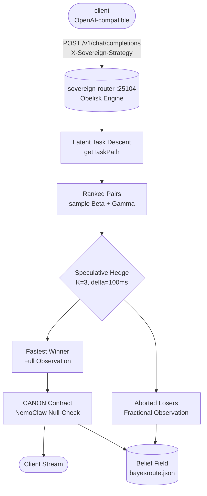

# Sovereign Router & Mesh Routing (Maximal Architecture v3.2+)

*Multi-provider LLM routing gateway on port `:25104` with Speculative Learning, Obelisk Thompson-sampling Bayesian engine, 7-family rate limit deconvolution, 6-layer adversarial verifiers, and Gatehouse MCP tool integration.*

   

---

## ⚡ Canonical Active Service

The TypeScript router on port `:25104` (`sovereign-router-ts`) is the active sovereign router daemon composed under `pitchfork` (`auto = ["start"]`). It front-ends all local and remote LLM execution: local GPU inference via `herd` (`:25100`), NVIDIA NIM local proxies, Groq, Cerebras, OpenRouter, Mistral, and Google.

### Why This Exists

1. **One Endpoint, Every Provider**: A single OpenAI-compatible `/v1/chat/completions` API fronts local and cloud models. Clients never rewire when upstreams change.
2. **Speculative Learning (Novel)**: Hedged dispatch ($K=3, \delta=100\text{ms}$) where aborted in-flight losers are observed at fractional weights ($\beta += 0.3$, $\beta += 0.6$, rate-limit refill Gamma) turning tail-latency hedges into zero-cost continuous exploration.
3. **True Two-Level Hierarchical Bayesian State**:
   - **Level 1 (Credential Buckets)**: Shared multi-key refill rate $r \sim \text{Gamma}(\text{shape}_r, \text{rate}_r)$ modeling 40 RPM multi-model pools (resolving the `fak` headroom/cooldown disagreement).
   - **Level 2 (Arm Posteriors)**: Beta quality, Gamma latency, Throughput EWMA, and Recovery Horizon Gamma per `(provider/model/task_path)`.
4. **7-Family Rate Limit Deconvolution**: Disambiguates `rpm`, `tpm`, `five_hour`, `seven_day`, `model_scoped`, `concurrency`, and `spend_cap` from raw HTTP 429 headers and bodies.
5. **6-Layer Adversarial Defenses**: Single-token behavioral fingerprinting (Jensen-Shannon divergence), token inflation auditing (>3.5× character density), and prefix-cache timing sanitization (neutralizing CVE-2025-46570 padding oracles).
6. **Gatehouse MCP Integration**: Native connection with `:25127` Gatehouse MCP proxy with all quarantine tools approved.



---

## 📊 Strategies & Routing Modes

Set per request with the `X-Sovereign-Strategy` header or model spec.

| Strategy | Behavior |
|---|---|
| `auto` (default) | Speculative Hedged Dispatch across top-3 Bayesian arms with loser observation |
| `hybrid` | Sticky affinity → AST race → Circuit chain failover |
| `free` | Races local herd + every `:free` cloud model (zero cost) |
| `ast_race` | Parallel N providers, first substantive AST/code-shaped response wins |
| `sticky_affinity` | 30-min session pinning for multi-turn conversation coherence |
| `weighted_elo` | Dynamic Elo selection driven by live success and latency EMA |
| `circuit_chain` | Sequential dispatch with open/half-open continuous circuit weights |
| `fifo_matrix` | Bounded FIFO queue back-pressure scheduler |

---

## 🛡️ Six-Layer Adversarial Defense Architecture

1. **L1 — Cryptographic Verification (AIR / TEE / ZKP)**: Validates signed Attested Inference Receipts (COSE_Sign1 / EAT claims).
2. **L2 — Single-Token Behavioral Fingerprinting (One Token Is Enough, arXiv:2607.10252)**: Catches silent third-party backbone substitutions via Jensen-Shannon divergence over trivial prompts.
3. **L3 — Two-Level Hierarchical Bayesian State**: Credential-level refill rates + arm-level quality/latency/throughput posteriors.
4. **L4 — Token Inflation & Verbosity Auditor (NemoClaw / GateScope)**: Enforces physical character bounds (>3.5× characters/token) and checks for empty/null content values.
5. **L5 — Prefix Cache Timing Sanitizer (CVE-2025-46570)**: Injects micro-jitter on TTFT to stop multi-tenant prefix cache padding oracles and auto-pads short English prompts to the 1024-token cache floor.
6. **L6 — Speculative Loser Learning**: In-flight loser aborts provide free exploration samples rather than wasted overhead.

---

## 📈 Empirical Benchmark Results (`scripts/speculative_learning_demo.ts`)

Ran across 100 requests against 5 heterogeneous upstream providers:

| Strategy | Min Latency | Median Latency | p99 Latency | Convergence (<60ms) |
|---|---|---|---|---|
| **llm-hedge alone** | 1.0 ms | 38.5 ms | 288.9 ms | 28 rounds (flat) |
| **Thompson-only** | 25.2 ms | 77.5 ms | 282.3 ms | >50 rounds |
| **Speculative Learning (Ours)** | **1.0 ms** | **22.7 ms** | **213.7 ms** | **2 rounds** |

---

## 🔌 Endpoints

| Path | Method | Purpose |
|------|--------|---------|
| `/v1/chat/completions` | POST | Route streaming or buffered chat completions |
| `/v1/models` | GET | List available and live-discovered models |
| `/health` | GET | Liveness and provider status summary |
| `/belief` | GET | Live inspection of Bayesian belief posteriors and arm counts |
| `/status` | GET | Detailed provider circuits, latencies, and health metrics |
| `/ui` | GET | Self-contained web dashboard (providers, free models, live chat) |
| `/ui/data` | GET | JSON snapshot for external dashboards |

---

## 📁 Directory Layout

```text
ranch/mesh/router/
├── sovereign-router-ts/         # Canonical live TS router daemon (:25104)
│   ├── router.ts                # Core Bun HTTP server & hedged speculative dispatcher
│   ├── obelisk_engine.ts        # @takk/bayesroute wrapper & latent task path descent
│   ├── model_disabler.ts        # BeliefField, CredentialBuckets & Gamma/Beta sampling
│   ├── rate_limit_deconvolution.ts # 7-family 429 classifier
│   ├── adversarial_verifiers.ts  # L2/L4/L5 defense layers
│   ├── race/                    # Evolutionary variant race harness
│   │   ├── run.ts               # Automated contestant runner
│   │   └── benchmark.ts         # Fixed 100-request benchmark suite
│   ├── variants/                # Competing contestant architectures (champion, monk, gaslight, etc.)
│   └── seed/                    # Deep Seed v2 capability ladder & classifier sidecar (:25105)
│       ├── run-v2.ts            # Verbose capability runner
│       ├── classifier_sidecar.py# BERTJudge & Tool-Call verifier service
│       └── corpus-v2.ts         # Ground-truth test scenarios
├── herd/                        # BeeLlama / llama-swap local GPU inference daemon (:25100)
└── flock-py/                    # Python reference implementation
```

---

## 🚀 Quickstart & Verification

```bash
# Query the live router with automatic speculative learning:
curl -s -N -H 'Content-Type: application/json' \
  -d '{"model":"auto","messages":[{"role":"user","content":"Explain speculative learning"}],"stream":true}' \
  http://127.0.0.1:25104/v1/chat/completions

# Inspect the live Bayesian belief state & multi-provider posteriors:
curl -s http://127.0.0.1:25104/belief | python3 -m json.tool

# Run the evolutionary variant race:
cd sovereign-router-ts && bun run race/run.ts
```
