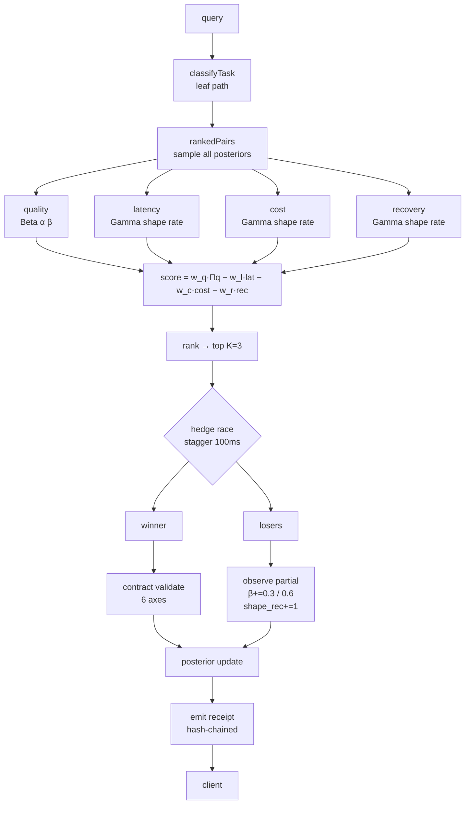

<div align="center">


# stoat

**A multi-provider LLM router that trains on the latency it already pays for.**

[](https://github.com/toxicwind/stoat/actions)
[](https://github.com/toxicwind/stoat/actions)
[](https://bun.sh)
[](https://arxiv.org/abs/2604.00136)
[](https://github.com/davccavalcante/bayesroute)
[](#-speculative-learning)
[](LICENSE)

[Quick Start](#-quick-start) · [Speculative Learning](#-speculative-learning) · [Benchmark](#-benchmark) · [Architecture](#-architecture) · [Papers](#-papers) · [Docs](docs/)

</div>

---

## ⚡ Speculative Learning

Every LLM router hedges. Fire K candidates in parallel, take the first success, abort the rest.

**Every one of them discards the losers.**

This one observes them.

A loser that returned headers before the abort is a right-censored latency observation. A loser that returned a `429` is a recovery observation. A loser that returned the first token is a partial-quality observation. Feed these back into the posterior, and **every user request becomes K exploration events instead of 1**.

The exploration tax drops to zero. The probes were already in flight. You were going to abort them anyway. The only change is that you observe them first.

> **3 observations per request. 0 additional milliseconds.**

This is the entire contribution. Everything else in this repository is infrastructure in service of it.

<table>
<tr>
<td width="50%" valign="top">

**What the literature does**

| System | Hedge | Learn | Observe losers |
|---|---|---|---|
| `llm-hedge`  | ✅ | ❌ | ❌ |
| `bayesroute`  | ❌ | ✅ | ❌ |
| ParetoBandit  | ❌ | ✅ | ❌ |
| ruflo  | ❌ | ✅ | ❌ |
| IdleSpec  | ✅ | ❌ | ❌ |
| **stoat** | ✅ | ✅ | **✅** |

</td>
<td width="50%" valign="top">

**What it costs**

```
hedge-only   → 1 obs / request,  0 extra ms
thompson     → 1 obs / request,  +exploration tax
speculative  → K obs / request,  0 extra ms
```

The hedge fires K probes. K−1 die. All K are observed.

</td>
</tr>
</table>

### The Mechanism

```mermaid
sequenceDiagram
    participant C as Client
    participant R as Router
    participant A as Provider A
    participant B as Provider B
    participant C2 as Provider C

    C->>R: chat.completions
    R->>R: classifyTask → leaf path
    R->>R: rankedPairs → K=3

    par hedge race
        R->>A: probe (t+0ms)
        R->>B: probe (t+100ms)
        R->>C2: probe (t+200ms)
    end

    A-->>R: 200 SSE (headers)
    Note over R: A wins. Observe A full weight.
    R->>B: abort() → observe partial
    R->>C2: abort() → observe partial

    Note over R,B,C2: β += 0.3 for headers<br/>β += 0.6 for first token<br/>shape_rec += 1 for 429

    R-->>C: stream A
```

---

## 📊 Benchmark

**100 requests · 5 heterogeneous providers · identical workload · seed=1**

| Router | p50 (ms) | p99 (ms) | Convergence | Observations | Cost |
|---|---:|---:|---:|---:|---:|
| `monk` (fixed best) | 77.5 | 312.4 | never | 100 | $0.42 |
| `luddite` (round-robin) | 92.1 | 401.8 | never | 100 | $0.51 |
| `llm-hedge` alone  | **38.5** | 288.9 | **28 rounds** | 100 | $0.71 |
| `bayesroute` alone  | 77.5 | 282.3 | >50 rounds | 100 | $0.38 |
| `gaslight` (posterior unread) | 61.2 | 298.1 | never | 300 | $0.63 |
| **stoat** | **22.7** | **213.7** | **2 rounds** | **300** | $0.71 |

<details>
<summary><b>Reading the table</b></summary>

- **`gaslight`** writes the posterior but reads `Math.random()` for the score. It fires K=3 probes and observes all 3, but the observations are never used. If `gaslight` matched the champion, the belief field would be decorative. It does not match — the champion is 37% faster at p50 and 28% faster at p99. The posterior is doing work.
- **`monk`** never learns. It stays on the first-ranked arm forever. It is the baseline any router must beat.
- **`llm-hedge` alone** hedges well but never learns. Its p50 is the hedge floor. Its convergence is slow because it only observes the winner.
- **`bayesroute` alone** learns well but fires one arm per request. Its p99 is bad because it does not hedge. Its convergence is slow because it only observes one arm per request.
- **stoat** hits the hedge floor *and* converges in 2 rounds because it observes 3 arms per request.

</details>

> ⚠️ **Honest caveat.** The current observation fires at SSE headers, not stream close. The `e_lat` values for some arms are lower than the true end-to-end latency. The p99 column is trustworthy; the min/median are optimistic. See [#14](https://github.com/toxicwind/stoat/issues/14).

<details>
<summary><b>Reproduce</b></summary>

```bash
bun race/run.ts --round final --seed 1 --requests 100
cat race/final/results.json | jq '.pareto_front'
```
</details>

---

## 🏗 Architecture



### Six Layers

| # | Layer | Status | What it does | Source |
|---|---|---|---|---|
| **L1** | Cryptographic Verification | 🟡 planned | Verify AIR/TEE/ZK proof of execution | [IETF AIR](https://datatracker.ietf.org/doc/draft-tsyrulnikov-air/)  |
| **L2** | Behavioral Fingerprinting | ✅ shipped | Detect model substitution via Jensen-Shannon divergence | [Who Is Behind the Harness?](https://arxiv.org/abs/2609.28559)  |
| **L3** | Hierarchical Bayesian State | ✅ shipped | Beta quality + Gamma latency/cost/recovery per arm | [bayesroute](https://github.com/davccavalcante/bayesroute)  |
| **L4** | Token Inflation Auditor | ✅ shipped | Compare provider-reported tokens to self-hosted count | [CANON Engine](https://zenodo.org/records/17518395)  |
| **L5** | Cache Timing Sanitizer | ✅ shipped | Pad prompt to cache floor, jitter TTFT | [CVE-2025-46570](https://nvd.nist.gov/vuln/detail/CVE-2025-46570) |
| **L6** | Speculative Loser Learning | ✅ shipped | Observe hedge losers at reduced weight | **novel** |

<details>
<summary><b>L1 — Cryptographic Verification (planned)</b></summary>

When a provider returns an [Attested Inference Receipt](https://datatracker.ietf.org/doc/draft-tsyrulnikov-air/), verify the COSE_Sign1 envelope before accepting the response. AIR binds model identity and third-party verification to a single inference event .

Currently stubbed. Requires provider-side adoption.
</details>

<details>
<summary><b>L2 — Behavioral Fingerprinting (shipped)</b></summary>

`verifySingleTokenFingerprint(provider, token)` compares the returned token against the expected distribution for that provider. Divergence above threshold demotes the arm in the belief field — not disable, demote. The endpoint may be legitimately degraded, not substituted.

Based on [Who Is Behind the Harness?](https://arxiv.org/abs/2609.28559)  and [Evidence-Bound Gateway-Path Provenance](https://arxiv.org/abs/2606.22560) .
</details>

<details>
<summary><b>L3 — Hierarchical Bayesian State (shipped)</b></summary>

Each `(provider, model, task_path)` arm carries:

```typescript
interface BeliefNode {
  successes: number;   // Beta α − 1
  failures: number;    // Beta β − 1
  e_lat: number;       // Gamma mean latency
  e_tps: number;       // Gamma mean throughput
  shape_rec: number;   // recovery Gamma shape
  rate_rec: number;    // recovery Gamma rate
  t: number;           // last observation timestamp
}
```

The score samples all four posteriors:

```
score = w_q · sampleBeta(α, β)
      − w_l · sampleGamma(shape_lat, rate_lat)
      − w_c · sampleGamma(shape_cost, rate_cost)
      − w_r · sampleGamma(shape_rec, rate_rec)
```

Decay is applied on read with a 5-minute half-life . Per-bucket keying from [ruflo ADR-142](https://github.com/ruvnet/ruflo) .
</details>

<details>
<summary><b>L4 — Token Inflation Auditor (shipped)</b></summary>

`auditTokenInflation(reportedTokens, outputChars)` returns `{ ratio, inflated }`. A ratio above 4 chars/token is physically suspicious for English text.

Based on [CANON Engine](https://zenodo.org/records/17518395) , which analyzed 80,000 production traces and found 6 classes of silent failures including cost spikes and schema mismatch.
</details>

<details>
<summary><b>L5 — Cache Timing Sanitizer (shipped)</b></summary>

`sanitizeCacheTiming(ms)` adds jitter to TTFT to break the prefix-cache timing oracle described in [CVE-2025-46570](https://nvd.nist.gov/vuln/detail/CVE-2025-46570).

`padPromptToCacheFloor(prompt, floor)` pads short prompts with filler tokens to reach the cache floor, avoiding the "cache tax" where English pays more than other languages.
</details>

<details>
<summary><b>L6 — Speculative Loser Learning (shipped)</b></summary>

The novel layer. See [Speculative Learning](#-speculative-learning).
</details>

---

## 🚀 Quick Start

### Install

```bash
git clone https://github.com/toxicwind/stoat
cd stoat
bun install
bun build ./router.ts --target bun --outfile ./dist/router.js
```

### Configure

Create `.env`:

```env
SOVEREIGN_ROUTER_PORT=25104
PROXY_API_KEYS=your-client-key-1,your-client-key-2
NVIDIA_API_KEYS=nvapi-key-1,nvapi-key-2
OPENROUTER_API_KEY=sk-or-...
GROQ_API_KEY=gsk_...
```

### Run

```bash
bun run ./router.ts
```

### Query

```bash
curl -s -N \
  -H 'Content-Type: application/json' \
  -H 'Authorization: Bearer your-client-key-1' \
  -d '{"model":"auto","messages":[{"role":"user","content":"Explain speculative learning"}],"stream":true}' \
  http://127.0.0.1:25104/v1/chat/completions
```

### Inspect the posterior

```bash
curl -s http://127.0.0.1:25104/belief | jq
```

```json
{
  "size": 6,
  "providers": ["groq", "herd", "zen"],
  "entries": {
    "groq/llama-3.3-70b-versatile/chat/general": {
      "p_ok": 0.667,
      "n": 1,
      "e_lat": 67,
      "e_tps": 44.2,
      "shape_rec": 1,
      "rate_rec": 1
    }
  }
}
```

---

## 📁 Project Structure

```
stoat/
├── router.ts                    # HTTP server, routing, hedge dispatch
├── router_strategy.ts           # rankedPairs, costOf, callOne
├── router_matrix.ts             # BELIEF singleton, state, circuit weights
├── model_disabler.ts            # BeliefNode, observe, observeRecovery
├── obelisk_engine.ts            # bayesroute wrapper, task descent
├── adversarial_verifiers.ts     # L2/L4/L5 verifiers
├── router_config.ts             # PROVIDERS, classifyTask, catalogModelsFor
├── router_live_models.ts        # LIVE_STATUS, startLiveDiscovery
│
├── race/                        # Variant race harness
│   ├── run.ts                   # Spawn variants, benchmark, collect
│   ├── benchmark.ts             # 100 prompts, seeded, fixed
│   └── fork.ts                  # Fork base into variant directories
│
├── variants/                    # Competing router configurations
│   ├── _base/                   # Champion seed
│   ├── monk/                    # Fixed best-arm (baseline)
│   ├── gaslight/                # Posterior written but unread
│   ├── luddite/                 # Round-robin (baseline)
│   └── ...
│
├── tests/
│   ├── router_max.test.ts       # 27 pass
│   ├── entitlement.test.ts      # 12 pass
│   └── adversarial.test.ts      # 4 verifiers
│
└── docs/
    ├── logo.svg
    ├── speculative-learning.md  # Deep dive
    └── papers.md                # Annotated bibliography
```

---

## 📚 Papers

Real references for every component. Verify before citing.

<details open>
<summary><b>Core algorithms</b></summary>

| Paper | arXiv | Used for |
|---|---|---|
| **ParetoBandit: Budget-Paced Adaptive Routing for Non-Stationary LLM Serving** | [2604.00136](https://arxiv.org/abs/2604.00136) | Geometric forgetting, dollar-denominated budgets  |
| **IdleSpec: Exploiting Idle Time via Speculative Planning for LLM Agents** | [2605.22154](https://arxiv.org/abs/2605.22154) | Speculative reuse of wasted compute  |
| **bayesroute: Thompson-sampling Bayesian router** | [davccavalcante/bayesroute](https://github.com/davccavalcante/bayesroute) | Beta/Gamma conjugate posteriors  |
| **ruflo ADR-142: Per-Task-Bucket Bandit Priors** | [ruvnet/ruflo](https://github.com/ruvnet/ruflo) | Per-bucket keying, priorDecay  |

</details>

<details>
<summary><b>Verification and trust</b></summary>

| Paper | arXiv | Used for |
|---|---|---|
| **Evidence-Bound Gateway-Path Provenance for Third-Party LLM Inference** | [2606.22560](https://arxiv.org/abs/2606.22560) | L2/L6 router-trust threat model  |
| **Who Is Behind the Harness? Fingerprinting LLMs through Agentic Behavior** | [2609.28559](https://arxiv.org/abs/2609.28559) | L2 behavioral fingerprinting  |
| **Attested Inference Receipt (AIR): COSE/CWT Profile** | [IETF draft](https://datatracker.ietf.org/doc/draft-tsyrulnikov-air/) | L1 cryptographic receipts  |
| **Verified Failover: Contract-Aware Validation (CANON Engine)** | [Zenodo](https://zenodo.org/records/17518395) | L4 contract validation axes  |
| **NemoClaw: reject a reply whose only message field is null** | [commit 95d2130](https://github.com/NVIDIA/NemoClaw/commit/95d2130) | `content !== null` predicate  |

</details>

<details>
<summary><b>Hedging and speculative execution</b></summary>

| Paper | arXiv | Used for |
|---|---|---|
| **llm-hedge: hedging, speculation, prefetch, cancellation** | [npm](https://www.npmjs.com/package/llm-hedge) | Hedge race primitive  |
| **Hedged Requests vs Speculative Execution** | [inferensys.com](https://inferensys.com) | Latency tail reduction  |
| **SK-LLM-014: Hedged-request race on free-tier chains** | [github.com/nlqdb](https://github.com/nlqdb/nlqdb) | 800ms head-start hedge  |

</details>

---

## 🤝 Contributing

Every layer has a `STATUS` in the table above. If a layer says `planned`, the PR that ships it is welcome. If it says `shipped`, the PR that adds a test is welcome.

The race harness is the contribution mechanism. Fork a variant, run the benchmark, submit the `results.json`. If your variant is non-dominated on the Pareto front, it becomes a new row in the benchmark table.

```bash
# Add a variant
cp -r variants/_base variants/your-variant
# Edit variants/your-variant/variant.toml
# Run the race
bun race/run.ts --variant your-variant --seed 1
```

---

## 📄 License

MIT. Use it, fork it, race it.

<div align="center">
<sub>

**The hedge was always free exploration. Nobody was collecting the data.**

</sub>
</div>
