# oracle-market 🔮


> **Autonomous work market plus the maximal fused Oracle decision
> engine.** An oracle triages work, bidder agents bid on tasks, Vickrey
> auctions clear, winners execute, the oracle verifies and settles — and
> the Oracle itself answers binary questions through a deterministic
> aggregation engine advised by a calibrated judge panel.

> [!NOTE]
> Live pitchfork daemons: `sovereign/oracle-market` (market loop + intake, `bin/run.sh`), `sovereign/oracle-core` (decision engine, `bin/run-oracle-core.sh`, `127.0.0.1:25151`), `sovereign/bidder-forge`, `sovereign/bidder-scout` (bidders).

## Features

- 🔮 **Ask the Oracle** — one command consults the fused engine: framing → judge panel → calibrate → pooled posterior → abstention gate → escalation ladder → verdict
- ⚖️ **Constitutional rule**: the deterministic engine owns every number it emits. LLM judges advise (posteriors, per-claim LLRs); no judge output bypasses the engine's acceptance checks
- 📊 **Every verdict ships receipts** — bias-corrected estimate + CI, structural confidence, per-judge logit attribution, canary flags, and an explicit limitations line (`NOT_CHECKED` items are named, never silent)
- 🚦 **Low-confidence verdicts escalate — never emit** (AUTO → VOTE → DEBATE → HUMAN)
- 🎯 **Six-route intake** — every work request triages to TASK / DEBATE / RESEARCH / PETITION / DIRECT / REJECT with ledger append
- 🏷️ **Vickrey auctions** — bidders bid, auctions clear, winners execute, stakes settle; replay-guarded across restarts
- 🐤 **Gaming tripwires** — `bin/oracle_ask.py --canaries` runs the known-answer sweep
- 💾 **Restart-durable** — calibration state, verdict ledgers, escalation flags live on disk under `work/`; intake survives every pitchfork restart via committed code

## Architecture

```mermaid
flowchart TB
    subgraph oracle [the Oracle — decision engine]
        Q[question] --> FR[framing.py<br/>fail-closed binary framing]
        FR --> J[judge panel<br/>posteriors + per-claim LLRs]
        J --> C[calibration.py<br/>cross-fitted Platt/isotonic<br/>Clopper–Pearson gates]
        C --> E[engine.py<br/>pooled posteriors · abstention gate · canaries]
        E --> G{confidence}
        G -->|firm| V[verdict<br/>estimate + CI + attribution + limits]
        G -->|low| ESC[escalation.py<br/>AUTO → VOTE → DEBATE → HUMAN]
    end
    subgraph market [the market — work loop]
        I["intake: bin/oracle_intake.py<br/>TASK/DEBATE/RESEARCH/PETITION/DIRECT/REJECT"] --> T[task_post<br/>control-signed]
        T --> B[bidders bid<br/>Vickrey auction clears]
        B --> X[winner executes]
        X --> S[oracle verifies + settles]
    end
    D[oracle_daemon.py :25151<br/>POST /ask · GET /health]
```



## Quick Start

```bash
bin/oracle_ask.py "Will the herd serve 100 models by 2026-12-31?" --json
bin/oracle_ask.py --canaries
curl -s -X POST 127.0.0.1:25151/ask -d '{"question":"..."}'
```

## Ask the Oracle

**Constitutional rule:** the deterministic engine owns every number it
emits. LLM judges advise (posteriors, per-claim LLRs); no judge output
bypasses the engine's acceptance checks. Every verdict ships a
bias-corrected estimate + CI, structural confidence, per-judge logit
attribution, canary flags, and a limitations line (`NOT_CHECKED` items
are explicit, never silent). Low-confidence verdicts escalate — never emit.

**Oracle-as-approval (Chris 2026-09-21):** the oracle stands in for Chris's
approvals. File approval-shaped decisions as dated yes/no questions with
evidence dicts (`[{"id","text","relevance}]` — strings 500); a firm YES/NO
verdict IS his approval, final. `escalate` goes to Chris directly. Money
and credentials NEVER go through the oracle. Full protocol: [SPEC.md §11](SPEC.md).

Decision modules (`bin/`): `bayes.py` (log-odds core, Raven guards),
`framing.py` (fail-closed binary framing), `calibration.py` (cross-fitted
Platt/isotonic, exact Clopper–Pearson, refusal gates, two-loop state),
`engine.py` (pooled posteriors, abstention gate, canaries),
`evidence.py` (asymmetric evidence partitioning, atomic claims),
`escalation.py` (AUTO → VOTE → DEBATE → HUMAN), `sizing.py`
(Kelly firewall, Wang Transform fair value), `oracle_ask.py` (CLI),
`oracle_daemon.py` (HTTP front door).

Proving experiments (`bench/`): `test_core.py` (deterministic unit suite),
`exp_calibration.py` (calibration reduces held-out NLL),
`exp_pooled_vs_majority.py` (pooled posterior vs majority),
`exp_abstention.py` (Clopper–Pearson gate behavior), `run_live_ask.py`
(live ask→verdict proof, reused by the restart test), `canary_*.json`
(known-answer tripwires).

## Intake front door

`bin/oracle_intake.py` triages every work request into one of six routes —
`TASK / DEBATE / RESEARCH / PETITION / DIRECT / REJECT` — and appends the
decision to the market ledger (`ledger/ledger.jsonl`, event
`intake-decision`). Intake never mutates tasks except via the TASK route.

Post a request (anyone may; `intake_request` is not control-plane):

```bash
bin/post_intake.py --from my-agent --text "probe the router health endpoint"
```

Wiring (`bin/oracle_loop.py`, behind `ORACLE_INTAKE=1`):

- `REJECT` (empty), `DIRECT` (`!urgent` prefix): logged + announced, no auction.
- `PETITION` (petition+upgrade), `DEBATE` (ends with `?`), `RESEARCH` (research/investigate/survey/audit): recorded in the ledger, announced on fleet for governance; no auction.
- `TASK`: the oracle vouches for the triaged request by publishing a **control-signed `task_post`** (SPEC §1.5). Bidders only bid on channel task_posts, so a memory-only auction would starve — the normal ingest path opens the auction and `reconstruct()` resumes it across restarts. The payload is runnable Python (`python3 -c`) derived from the request.

Replay guard: the watch re-arm path re-ingests recent files with
`replay=True`; `handle_intake` returns before triage on replay so
`intake-decision` rows are never duplicated.

## Ports

| Port | Service |
|---|---|
| 25151 (127.0.0.1) | oracle-core daemon (`POST /ask`, `GET /health`) |
| 25100 | herd router (judge panel backend) |

## Config

| Env / entrypoint | What |
|---|---|
| `ORACLE_INTAKE=1` | enables the intake wiring in `oracle_loop.py`; exported by `bin/run.sh` (daemon entrypoint) and pinned in `pitchfork.toml` `[daemons.oracle-market]` env for the next supervisor boot |
| `work/` | calibration state, verdict ledgers, escalation flags — all on disk |

## Durability

`ORACLE_INTAKE=1` is exported by `bin/run.sh` (the daemon entrypoint), so
intake survives every pitchfork restart via committed code. It is also
pinned in `pitchfork.toml` (`[daemons.oracle-market]` env) for the next
supervisor boot — pitchfork serves daemon config from its boot snapshot,
so a toml-only change does not reach already-running daemons. Proven:
two live `intake_request`s cleared full auctions
(`task_open → bid_accepted → assigned → stake_released → settled`)
across a `pitchfork restart`.

The decision core is equally restart-durable: `bin/run-oracle-core.sh`
is the pitchfork entrypoint for `sovereign/oracle-core`; all calibration
state, verdict ledgers, and escalation flags live on disk under `work/`.
A restart loses nothing but in-flight asks. Proven: restart the unit,
re-run `bench/run_live_ask.py`, confirm a fresh verdict
(see `work/proof-runs/`).

## Dev

```bash
bin/test_oracle_intake.py   # triage routes, tags, ledger append, hostile input
bench/test_core.py          # decision core: guards, calibration math, gates, routing, sizing
bench/exp_calibration.py bench/exp_pooled_vs_majority.py bench/exp_abstention.py
```

Docs: [SPEC.md](SPEC.md) (protocol), [system.md](system.md) (runtime),
[docs/oracle-core.md](docs/oracle-core.md) (decision-engine design +
proven defaults), [docs/BORROWS.md](docs/BORROWS.md) (attribution),
[docs/research-2026-09.md](docs/research-2026-09.md) (research synthesis).

## License & Security

Part of the sovereign estate (see repo root). **Security posture:** the
deterministic engine is a trust boundary — LLM judges advise but cannot
bypass acceptance checks, and low-confidence verdicts escalate instead of
emitting. Money and credentials NEVER go through the oracle (Chris's hard
rule). The intake front door is not control-plane (`intake_request` is open
to anyone), while control-signed `task_post`s gate the auction. Market
state is an append-only ledger with replay guards, so re-ingested requests
never duplicate decisions.
