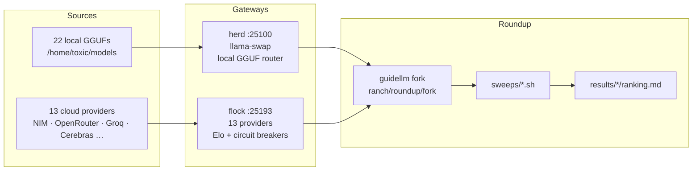

<div align="right">

[](https://github.com/toxicwind/roundup)
[](https://github.com/vllm-project/guidellm)
[](https://github.com/toxicwind/herd)
[](https://github.com/toxicwind/flock)
[](./docs/UPSTREAM-MERGE.md)

</div>

# 🐄 roundup

> 🗺️ Part of [**the ranch**](https://github.com/toxicwind/ranch) — the whole inference estate, one map.

**A cattle roundup gathers and assesses every head. This one gathers and assesses every model.**

Seventy-five local models on a 3090 and thirteen cloud providers behind one
gateway — roundup measures all of them with the same harness, the same scorer,
and the same questions, then ranks them on the only two axes that matter:

> **quality descending, then p50 latency ascending. Cost is not a factor.**

## Why it exists

Choosing an inference backend by vibes produces bad backends. Every "this model
is faster" claim we have ever written down was unmeasured. roundup closes that
gap with a vendored fork of [GuideLLM](https://github.com/vllm-project/guidellm)
that scores *response quality*, not just tokens per second — because a provider
that returns garbage quickly is not fast, it is wrong.

It answers three questions nothing else on the estate can:

- **Which backend is actually best** for a given workload, right now, tonight?
- **Which upstream provider is worth trusting** — flock already tracks Elo and
  circuit state per provider; roundup adds measured latency on top.
- **What did our own fork change** when we pull from upstream, and is any of it
  upstreamable?



## Quick start

```bash
# 1. benchmark every model herd can load, discovered live from the gateway
./sweeps/roundup_herd_sweep.sh

# 2. read the ranking (quality desc, p50 latency asc)
cat results/herd/ranking.md

# 3. check the fork is still in step with upstream before you merge
./scripts/upstream-merge.sh --status
```

## Layout

| Path | What it is |
|---|---|
| [`fork/`](./fork) | The `toxicwind/roundup` codebase — 525 tracked files vendored in-tree. Real files, not a submodule. |
| [`sweeps/`](./sweeps) | The benchmark runs. One script per question. |
| [`scripts/`](./scripts) | Upstream sync tooling. |
| [`docs/`](./docs) | Eval plan, upstream audit, and the merge procedure. |
| `results/` | Written by the sweeps. Not committed. |

## Sweeps

| Script | Question it answers | Route |
|---|---|---|
| [`roundup_herd_sweep.sh`](./sweeps/roundup_herd_sweep.sh) | Which **local** model is best? Models discovered live from herd `/v1/models` on every run. | herd `:25100` |
| [`roundup-bench.sh`](./sweeps/roundup-bench.sh) | Which **provider** is best, using the fork's `instruction_following` scorer via scenario YAML? | flock + NIM + vLLM remote |
| [`roundup-bench-v3.sh`](./sweeps/roundup-bench-v3.sh) | Same, with capability probing so unsupported backends fail loudly instead of silently. | flock + NIM + vLLM remote |
| [`roundup_sweep.sh`](./sweeps/roundup_sweep.sh) | Quick sanity pass over working OpenRouter models. | OpenRouter |
| [`dump-roundup.sh`](./sweeps/dump-roundup.sh) | Give me everything in this directory as one readable dump. | — |

All of them rank the same way and write the same shape:
`results/{herd,bench,sweeps}/ranking.md`.

### Ranking

```
Rank: quality desc, p50 latency asc
```

Quality comes from the fork's pluggable scorer registry — the built-in
`instruction_following` scorer, plus whatever else is registered. Cost is
deliberately excluded; that is a standing decision, not an oversight.

### Why the sweeps read no credentials

> **Benchmark traffic goes through the herd router, never direct to providers.**

herd and flock own every provider credential. The herd sweep reads no secrets,
passes no `api_key` to GuideLLM, and prints none. The provider sweeps pull
`FLOCK_KEY`, `NIM_KEY`, and `VR_KEY` out of `/home/toxic/.secrets` in-process
and never echo them. If you find yourself adding `--api-key` to a sweep, you
have broken the rule.

## The fork

`roundup` is a fork of `vllm-project/guidellm`. It exists **twice**, on purpose:

- **[github.com/toxicwind/roundup](https://github.com/toxicwind/roundup)** — the
  real git history and the `upstream` remote. The only place a merge can happen.
- **`fork/`** — 525 tracked files, 18 MB, committed into the ranch monorepo so a
  fresh clone gets a working benchmark with no submodule and no second checkout.

Those are not drifting copies. `scripts/upstream-merge.sh` is what keeps them in
step.

### Our four upstreamable commits

| Commit | Change | Upstreamable |
|---|---|---|
| `74ec8623` | Pluggable response-quality scoring; `guidellm/benchmark/scoring/` with the built-in `instruction_following` scorer | yes — additive |
| `bb96157f` | HF tokenizer failures split into auth / missing-revision / network instead of one opaque exception | yes — error taxonomy |
| `99540b90` | Empty output scores `0.0` instead of skipping; scorer exceptions record `0.0` with error metadata | yes, with discussion |
| `6b40c21e` | Quality aggregates cover completed requests only | yes, as a pair with `99540b90` |

**History rules: never rebase, never squash, never force-push the fork's main.**
When upstream takes our work we merge their changes back as a merge commit, so
the histogram stays honest. PRs to an external project are Chris's call, not an
agent's.

Full procedure, including how to clone the standalone and what to check before
pushing anything: **[docs/UPSTREAM-MERGE.md](./docs/UPSTREAM-MERGE.md)**.

## Docs

- [docs/UPSTREAM-MERGE.md](./docs/UPSTREAM-MERGE.md) — how upstream changes get in, and why
- [docs/GUIDELLM_EVAL_PLAN.md](./docs/GUIDELLM_EVAL_PLAN.md) — what we are trying to measure
- [docs/upstream-audit-guidellm-2026-09-20.md](./docs/upstream-audit-guidellm-2026-09-20.md) — the fork-vs-upstream audit behind the four commits

## Security

- Sweeps print **no credentials**. Keys are read in-process from
  `/home/toxic/.secrets` (mode 600) and passed straight to the gateway.
- Benchmark traffic is routed through herd/flock so provider keys never leave
  the estate.
- The venv lives at `/home/toxic/.venv-guidellm` as an **editable install of the
  fork**. Editing `fork/` changes what `guidellm` runs — that is the point, and
  also the reason to treat it as production code.
- `scripts/upstream-merge.sh` refuses to sync from a partial checkout. Deleting
  requires `--prune-into` explicitly.

## License

The fork is [Apache-2.0](https://github.com/vllm-project/guidellm/blob/main/LICENSE),
matching upstream GuideLLM. Our sweep and tooling scripts in `sweeps/` and
`scripts/` are MIT. See [`fork/LICENSE`](./fork/LICENSE) and
[`fork/MERGE-DECISIONS.md`](./fork/MERGE-DECISIONS.md).

> Renamed from `guidellm/` on 2026-09-30 (`toxicwind/guidellm` →
> `toxicwind/roundup`). The benchmarking tool under the hood is still GuideLLM —
> roundup is the estate brand.