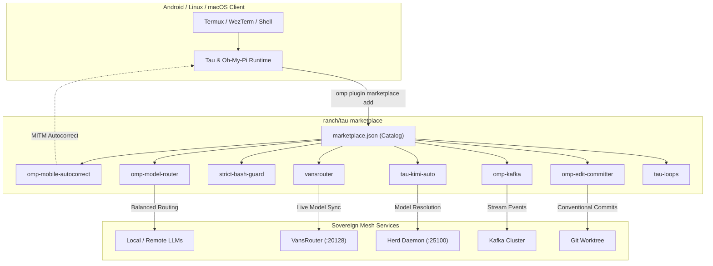

# tau-marketplace

<div align="right">

[](./LICENSE)
[](https://bun.sh)
[](#plugins)
[](https://anthropic.com/claude-code/marketplace.schema.json)
[](#)

</div>

> **The official Sovereign Estate marketplace for [Tau](https://github.com/toxicwind/tau) and [Oh-My-Pi](https://github.com/toxicwind/oh-my-pi) extensions, ambient tools, and agent plugins.**

From in-process mobile touchscreen autocorrect and dynamic local inference routers to auto-committing git workflows and real-time Kafka streams — install what you need in one command, with zero external daemons.

---



---

## ⚡ Quick Start

### 1. Register the Marketplace in Tau / OMP
```bash
# Add this repository to your configured marketplaces
omp plugin marketplace add /home/toxic/estate/ranch/tau-marketplace
```

### 2. Discover Available Plugins
```bash
# List all plugins in the marketplace
omp plugin discover tau-marketplace
```

### 3. Install Any Plugin
```bash
# Install mobile autocorrect for Termux & touchscreen sessions
omp plugin install omp-mobile-autocorrect@tau-marketplace

# Install the VansRouter local model provider
omp plugin install vansrouter@tau-marketplace

# Install the strict bash guard
omp plugin install strict-bash-guard@tau-marketplace
```

---

## 📦 Curated Plugins

| Plugin | Version | Category | Description | Source |
|---|:---:|---|---|---|
| **[`omp-mobile-autocorrect`](./plugins/omp-mobile-autocorrect)** | `1.0.0` | `mobile` | In-process MITM spatial QWERTY autocorrect for Termux and glass keyboards (sub-5ms, protects code & flags) | [`plugins/omp-mobile-autocorrect`](./plugins/omp-mobile-autocorrect) |
| **[`vansrouter`](./plugins/vansrouter)** | `1.0.0` | `model-provider` | OpenAI-compatible local model provider with live dynamic catalog sync from VansRouter (`:20128`) | [`plugins/vansrouter`](./plugins/vansrouter) |
| **[`strict-bash-guard`](./plugins/strict-bash-guard)** | `1.0.0` | `safety` | Tool guard intercepting `bash` tool calls and blocking redundant shell commands to enforce native tools | [`plugins/strict-bash-guard`](./plugins/strict-bash-guard) |
| **[`omp-model-router`](./plugins/omp-model-router)** | `1.0.0` | `routing` | Dynamic multi-model router, prompt classifier, token estimator, fallback picker, and cost governor | [`plugins/omp-model-router`](./plugins/omp-model-router) |
| **[`tau-kimi-auto`](./plugins/tau-kimi-auto)** | `1.0.0` | `model-provider` | Virtual model provider dynamically resolving to the best healthy Kimi model via herd (`:25100` / `:25153`) | [`plugins/tau-kimi-auto`](./plugins/tau-kimi-auto) |
| **[`omp-edit-committer`](./plugins/omp-edit-committer)** | `0.1.0` | `workflow` | Transactional conventional-commit generator with visual hunk badges for all file modifications | [`plugins/omp-edit-committer`](./plugins/omp-edit-committer) |
| **[`omp-kafka`](./plugins/omp-kafka)** | `0.1.0` | `integration` | Real-time Kafka topic streaming consumer with push/pull modes and `/kafka-*` slash commands | [`plugins/omp-kafka`](./plugins/omp-kafka) |
| **[`tau-loops`](./plugins/tau-loops)** | `1.0.0` | `diagnostics` | Bounded diagnostic loops (`/loop-model-audit`, `/loop-dir-diff`, `/loop-probe`) for stack verification | [`plugins/tau-loops`](./plugins/tau-loops) |

---

## 🎯 Spotlight: `omp-mobile-autocorrect`

Typing prompts on mobile glass in Termux is painful because Android terminal emulators set `InputType.TYPE_TEXT_FLAG_NO_SUGGESTIONS` to prevent OS autocorrect from mangling CLI commands (`ls -la` → `is -la`, `bunx` → `bunk`).

`omp-mobile-autocorrect` solves this with an in-process Man-in-the-Middle middleware:

* **2D QWERTY Spatial Topology**: Keys have coordinates $(x, y) \in \mathbb{R}^2$; distance incorporates vertical sweep penalty:
  $$\text{dist}(c_1, c_2) = \sqrt{(x_1 - x_2)^2 + (1.25 \cdot (y_1 - y_2))^2}$$
* **Spatial Damerau-Levenshtein**: Adjacent slips (`o` $\leftrightarrow$ `i`, `w` $\leftrightarrow$ `a`, `s` $\leftrightarrow$ `a`, `k` $\leftrightarrow$ `o`) cost only $\sim 0.25$–$0.35$.
* **Immutable Code Protection**: File paths (`pool.js`), CLI flags (`--noEmit`), identifiers (`authHeader`, `bg_9`), URLs (`http://...`), and backtick code blocks (`` `diff` ``) are strictly preserved.
* **Dual Lifecycle Hooks**: Runs on interactive `input` and as a pre-LLM `context` safety gate.
* **Sub-5ms Execution**: Fully synchronous in-memory TypeScript — zero daemon dependencies, zero network overhead.

```
Input:    figure iut what the diff between each keys are and make a md wfter you uodste all to cojvention
Output:   figure out what the diff between each keys are and make a md after you update all to convention
TUI Bar:  Termux Autocorrect: [iut→out, wfter→after, uodste→update, cojvention→convention]
```

---

## 🛠️ Marketplace Architecture

`tau-marketplace` complies with the Claude Code / Oh-My-Pi marketplace specification:

1. **`marketplace.json`**: Root catalog containing plugin metadata, categories, tags, source relative paths, and licensing.
2. **Dual Namespace Catalogs**:
   - `.omp-plugin/marketplace.json` — primary discovery path for OMP.
   - `.claude-plugin/marketplace.json` — fallback discovery path for Claude-compatible clients.
3. **Plugin Directory Layout**:
   ```
   plugins/<plugin-name>/
   ├── package.json          # Node/Bun package metadata
   ├── .omp-plugin/
   │   └── plugin.json       # OMP plugin declaration
   ├── index.ts              # ExtensionAPI default export
   └── README.md             # Plugin documentation
   ```

---

## 🧪 Verification & Development

Run the validation suite to inspect all plugins, schemas, and entry points:

```bash
# Validate catalog integrity
bun run validate

# Run unit tests across all plugins
bun test
```

Expected output:
```
=== TAU MARKETPLACE VALIDATOR ===
Root: /home/toxic/estate/ranch/tau-marketplace
Catalog: /home/toxic/estate/ranch/tau-marketplace/marketplace.json

Marketplace: "tau-marketplace" (version 1.0.0)
Owner: toxicwind
Plugins declared: 8

[PASS] omp-mobile-autocorrect (v1.0.0)
[PASS] vansrouter (v1.0.0)
[PASS] strict-bash-guard (v1.0.0)
[PASS] omp-model-router (v1.0.0)
[PASS] tau-kimi-auto (v1.0.0)
[PASS] omp-edit-committer (v0.1.0)
[PASS] omp-kafka (v0.1.0)
[PASS] tau-loops (v1.0.0)

Validation complete: 8 passed, 0 failed.
ALL MARKETPLACE PLUGINS VALID!
```

---

## 📄 License & Contributing

Licensed under the [MIT License](./LICENSE).

Contributions are welcome! Please follow the established [Sovereign Contributor Guidelines](./CONTRIBUTING.md) and verify your changes with `bun run validate` before submitting.
