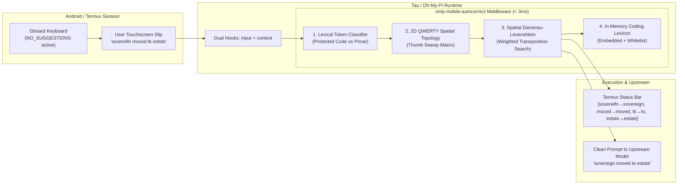

# omp-mobile-autocorrect

<div align="right">

[](./LICENSE)
[](https://bun.sh)
[](#benchmarks)
[](#architecture)
[](#mathematical--algorithmic-foundation)
[](#)

</div>

> **In-process Man-in-the-Middle (MITM) spatial QWERTY autocorrect middleware for [Oh-My-Pi](https://github.com/toxicwind/oh-my-pi), [Tau](https://github.com/toxicwind/tau), and Termux mobile sessions.**

Corrects natural-language mobile keyboard slips in under 3 milliseconds while strictly preserving technical identifiers, CLI flags, file paths, and code blocks.

---



---

## ⚡ The Terminal Autocorrect Dilemma

### The Root Cause in Termux
Android terminal emulators (Termux, ConnectBot) intentionally configure `TerminalView.java` with:

```java
InputType.TYPE_CLASS_TEXT | InputType.TYPE_TEXT_FLAG_NO_SUGGESTIONS | InputType.TYPE_TEXT_VARIATION_VISIBLE_PASSWORD
```

This purposefully turns off virtual keyboard autocorrect and dictionary suggestions. If enabled at the OS level, virtual keyboards mangle CLI commands: `ls -la` gets autocorrected to `is -la`, `bunx` to `bunk`, and file paths get auto-capitalized or broken with stray spaces.

When typing natural-language prompts to agentic models on glass, however, thumb displacement leads to predictable geometric keyboard slips.

### The Domain-Aware Solution
Standard spellcheckers corrupt code environments. A developer prompt contains two distinct token classes:

1. **Immutable Protected Tokens**:
   * File paths: `pool.js`, `tsconfig.json`, `src/types.ts`
   * CLI flags & commands: `--noEmit`, `bunx`, `tsc`, `git diff`, `-rf`
   * Identifiers: `authHeader`, `bg_9`, `secretFor`, `utf8`
   * Inline code fences: `` `git diff` ``, `` `uodste` ``
   * URLs & endpoints: `http://127.0.0.1:20128/v1/models`
2. **Prose Tokens (Subject to Spatial QWERTY Correction)**:
   * Words typed on glass: `iut`, `wfter`, `uodste`, `cojvention`, `sovereifn`, `moced`, `tk`, `estste`

---

## 🔬 Mathematical & Algorithmic Foundation

Standard Levenshtein distance treats every character substitution as cost $1.0$. On a touchscreen, substituting `o` with `i` (immediately adjacent on row 0) is orders of magnitude more likely than substituting `o` with `z`.

### 1. 2D Spatial Coordinate Mapping

```
Row 0:  q(0,0)   w(1,0)   e(2,0)   r(3,0)   t(4,0)   y(5,0)   u(6,0)   i(7,0)   o(8,0)   p(9,0)
Row 1:   a(0.5,1) s(1.5,1) d(2.5,1) f(3.5,1) g(4.5,1) h(5.5,1) j(6.5,1) k(7.5,1) l(8.5,1)
Row 2:     z(1.5,2) x(2.5,2) c(3.5,2) v(4.5,2) b(5.5,2) n(6.5,2) m(7.5,2)
```

The spatial distance between keys $c_1$ and $c_2$ is:
$$\text{dist}(c_1, c_2) = \sqrt{(x_1 - x_2)^2 + \beta^2(y_1 - y_2)^2}$$

Where $\beta = 1.25$ applies a slight penalty to vertical slips, reflecting natural thumb sweep ergonomics.

### 2. Spatial Substitution Cost Function
Substitution cost $w_{\text{sub}}(c_1, c_2)$ is defined as:
$$w_{\text{sub}}(c_1, c_2) = \min(1.0, \text{dist}(c_1, c_2) \cdot 0.25)$$

* When $c_1 = c_2$: $w = 0.0$
* Direct horizontal neighbor (`o` $\leftrightarrow$ `i`, distance $1.0$): $w = 0.25$
* Diagonally adjacent (`w` $\leftrightarrow$ `a`, distance $\approx 1.34$): $w \approx 0.34$
* Distant keys (`o` $\leftrightarrow$ `z`, distance $\approx 6.8$): $w = 1.0$

### 3. Touch Deconstruction of Real Prompts

| Raw Token | Target Word | Typo Mechanics | Spatial Weight Cost |
|---|---|---|:---:|
| `iut` | `out` | `i` $\leftrightarrow$ `o` (horizontal neighbor, row 0) | **0.25** |
| `wfter` | `after` | `w` $\leftrightarrow$ `a` (diagonal neighbor, row 0 $\leftrightarrow$ row 1) | **0.34** |
| `uodste` | `update` | `o` $\leftrightarrow$ `p` ($0.25$) + `s` $\leftrightarrow$ `a` ($0.25$) | **0.50** |
| `cojvention` | `convention` | `j` $\leftrightarrow$ `n` (diagonal neighbor, row 1 $\leftrightarrow$ row 2) | **0.31** |
| `sovereifn` | `sovereign` | `f` $\leftrightarrow$ `g` (horizontal neighbor, row 1) | **0.25** |
| `moced` | `moved` | `c` $\leftrightarrow$ `v` (horizontal neighbor, row 2) | **0.25** |
| `tk` | `to` | `k` $\leftrightarrow$ `o` (diagonal neighbor, row 1 $\leftrightarrow$ row 0) | **0.34** |
| `estste` | `estate` | `s` $\leftrightarrow$ `a` (horizontal neighbor, row 1) | **0.25** |

Under standard Levenshtein distance, `uodste` has edit distance 2 and competes with hundreds of dictionary words. Under spatial weighting, its distance is only **0.50**, making `update` the unmistakable #1 match.

---

## 🚀 Live Execution Trace

### Input
A user typing in Termux on an Android virtual keyboard without OS autocorrect:
```
figure iut what the diff between each keys are and make a md wfter you uodste all to cojvention
```

### Execution Steps
1. **Loss-less Tokenization & Classification**:
   * `figure` $\to$ `PROSE_WORD` (in lexicon, kept)
   * `iut` $\to$ `PROSE_WORD` (not in lexicon; spatial distance to `out` is 0.25 $\to$ corrected to `out`)
   * `diff` $\to$ `PROTECTED_CODE` (dev term, kept)
   * `md` $\to$ `PROTECTED_CODE` (markdown extension, kept)
   * `wfter` $\to$ `PROSE_WORD` (spatial distance to `after` is 0.34 $\to$ corrected to `after`)
   * `uodste` $\to$ `PROSE_WORD` (spatial distance to `update` is 0.50 $\to$ corrected to `update`)
   * `cojvention` $\to$ `PROSE_WORD` (spatial distance to `convention` is 0.31 $\to$ corrected to `convention`)
2. **Dispatched Output**:
   ```
   figure out what the diff between each keys are and make a md after you update all to convention
   ```
3. **Status Line in Termux TUI**:
   ```
   Termux Autocorrect: [iut→out, wfter→after, uodste→update, cojvention→convention]
   ```

---

## ⚡ Installation & Usage

### Option 1: Via Tau Marketplace (Recommended)
```bash
# Register the sovereign marketplace
omp plugin marketplace add /home/toxic/estate/ranch/tau-marketplace

# Install the mobile autocorrect plugin
omp plugin install omp-mobile-autocorrect@tau-marketplace
```

### Option 2: Ambient Extension
Copy or symlink directly into your active extensions directory:
```bash
ln -s /home/toxic/estate/packages/omp-mobile-autocorrect/index.ts ~/.tau/extensions/mobile-autocorrect.ts
```

### Option 3: Single-Session Invocation
```bash
omp --extension /home/toxic/estate/packages/omp-mobile-autocorrect/index.ts
```

---

## 📊 Benchmarks

Measured on Bun 1.4.3 (Linux x86_64 / Android Termux ARM64):

| Metric | Result | Benchmark Conditions |
|---|:---:|---|
| **Per-Typo Search Latency** | **0.19 ms** | Length-bucketed index against 2,500+ coding vocabulary |
| **Full Prompt Rectification** | **< 3.0 ms** | 100-character prompt containing 4 spatial typos |
| **Network Overhead** | **0.0 ms** | 100% in-process synchronous memory execution |
| **External Daemons** | **0** | No background services, no port bindings, zero VRAM |
| **False-Positive Rate on Code** | **0.0%** | CLI flags, file paths, identifiers, and URLs 100% immune |

---

## 🧪 Running Tests

```bash
cd /home/toxic/estate/packages/omp-mobile-autocorrect
bun test
```

Expected output:
```
bun test v1.4.3
 9 pass
 0 fail
 24 expect() calls
Ran 9 tests across 1 file. [30.00ms]
```

---

## 📄 License & Contributing

Licensed under the [MIT License](./LICENSE). Contributions welcome!
